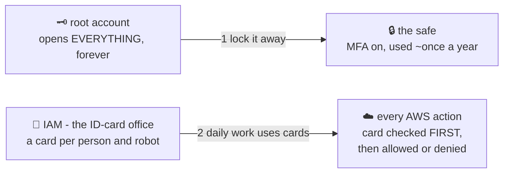

# 🗝️ Lesson 01 — Why IAM: lock away the master key

**📍 You are here:** Lesson **01** of 12 · Next: `lesson-02-users-groups`

---

## 📦 What's in this branch

The foundation of AWS security: **why identity exists at all**, and the first
thing every new AWS account must do — lock away root.

## 🧒 Explain like I'm 5

A school has ONE **master key** 🗝️ that opens *everything* — every classroom,
the office, the safe with the exam papers. Imagine the principal photocopied
it and gave one to every teacher, student and janitor "to keep things simple".

Now: exam papers leak. **Who did it?** Nobody knows — everyone's key opens
that safe. Someone leaves the school? You'd have to change EVERY lock.

That master key is your AWS **root account** — the email you signed up with.
It can do everything, forever, including deleting the whole account. The
first rule of AWS:

> **Lock the master key in the safe.** 🔒 Root gets MFA (a second lock that
> needs your phone), gets used maybe once a year for account-level things,
> and NEVER for daily work.

For daily work, the school opens an **ID-card office** — that's **IAM**.
Every person and every robot gets their *own* card, with their *own* short
list of doors it opens. Lost card? Cancel ONE card. Mystery action? The
logbook says exactly whose card did it.

## 🗺️ Diagram



## ❓ What

- **Root** = the account's owner identity. Only it can do a few things
  (close account, change support plan) — that's what it's *for*.
- **IAM** = the free service managing **who** (users, roles) may do **what**
  (actions) on **which things** (resources).
- Every single AWS API call — console click, CLI command, SDK call from
  code — is authenticated (whose card?) and authorized (does a slip allow
  this?) before anything happens. No card, no entry. Default is **no**.

## 🤔 Why

Every later course leaned on IAM without saying so: the Docker course's ECR
login, the k8s course's EKS nodes and CircleCI context, the ArgoCD course's
"credentials never leave the cluster" argument. This course opens that black
box — because the #1 cause of AWS horror stories is not hackers breaking
crypto; it's leaked all-powerful credentials that IAM hygiene would have
prevented.

## 🧪 Try it (free)

```bash
# who am I right now?
aws sts get-caller-identity
# if "Arn" ends in :root → this lesson is URGENT for you 😅
# it should show an IAM user or an assumed role

# the account's security report card:
aws iam get-account-summary --query 'SummaryMap.{Users:Users,MFADevices:MFADevices,AccountMFAEnabled:AccountMFAEnabled}'
# AccountMFAEnabled MUST be 1. If 0 → console → root → enable MFA today.

# console homework (5 min): sign in as root ONCE →
#   1) enable MFA on root   2) create your admin IAM user (lesson 02)
#   3) sign out of root — ideally forever
```

## ⏭️ Next

Cards for people, and lists that make permissions manageable: **users &
groups**.

```bash
git checkout lesson-02-users-groups
```
