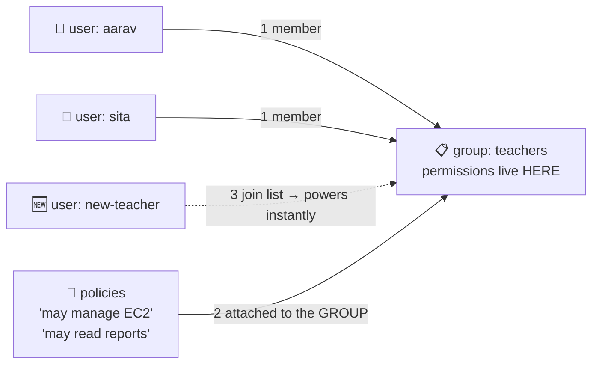

# 🪪 Lesson 02 — Users & groups: cards and staff lists

**📍 You are here:** Lesson **02** of 12 · Previous: `lesson-01-why-iam` · Next: `lesson-03-policies`

---

## 📦 What's in this branch

Lesson 01, **plus**: identities for humans — **users** — and the trick that
keeps permissions manageable — **groups**.

## 🧒 Explain like I'm 5

The ID-card office opens. Every person gets their **own card** 🪪 with their
name on it: `aarav`, `sita`, `balasaheb`. Nobody shares cards — sharing cards
is how lesson 01's mess restarts.

But giving permissions card-by-card gets silly fast: 20 teachers × 10
permissions = 200 things to manage, and every new teacher means re-doing all
of it. The office's trick: **staff lists** 📋 (groups).

- Make a list called **"teachers"**. Attach the permission slips to the
  LIST, not to people.
- New teacher joins? **Add their card to the list** — all powers arrive
  instantly. Teacher leaves? Remove from the list — all powers gone.
- People can be on several lists: `sita` is on "teachers" AND "exam-setters".

One rule the office enforces gently: **cards are for humans**. Robots
(servers, CI) get something better in lesson 04 — because cards come with
passwords, and robots shouldn't have passwords at all.

## 🗺️ Diagram



## ❓ What

- **User** = a permanent identity for ONE human: console password (with MFA!)
  and/or API access keys (avoid where possible — lesson 05).
- **Group** = a bag of users; policies attach to it; membership = permission.
  Groups can't be nested, and can't be "assumed" — they're just bags.
- Modern note: for companies, **IAM Identity Center (SSO)** replaces most
  IAM users — humans log in via short-lived sessions. Same mental model
  (people → groups → permissions), better hygiene. Learn users first;
  they're the concept SSO streamlines.

## 🤔 Why

Attaching permissions to *roles-in-the-organization* ("teachers") instead of
*individuals* is the only version that survives growth: onboarding is
one command, offboarding is one command, and an audit reads like an org
chart instead of 200 sticky notes.

## 🧪 Try it (free)

```bash
# make the list, then a card, then connect them:
aws iam create-group --group-name learners
aws iam create-user  --user-name test-student
aws iam add-user-to-group --group-name learners --user-name test-student

# give the LIST a permission (read-only everything, an AWS-managed policy):
aws iam attach-group-policy --group-name learners \
  --policy-arn arn:aws:iam::aws:policy/ReadOnlyAccess

# what can test-student do, and via what?
aws iam list-groups-for-user --user-name test-student
aws iam list-attached-group-policies --group-name learners

# cleanup (labs leave no trace):
aws iam detach-group-policy --group-name learners --policy-arn arn:aws:iam::aws:policy/ReadOnlyAccess
aws iam remove-user-from-group --group-name learners --user-name test-student
aws iam delete-user --user-name test-student
aws iam delete-group --group-name learners
```

## ✅ Verify — what you should see

`aws iam list-groups-for-user --user-name aarav` lists the group; `aws iam list-attached-group-policies --group-name teachers` shows the policy attached to the **group**, not the user.

## 🧹 Clean up — do not leave running

nothing to clean up — this lesson is free 🎉

## ⚠️ Common mistakes

- attaching policies to users one by one — attach to the group
- a `developers` group with AdministratorAccess (that's not a group, that's root with extra steps)
- forgetting that a user with no group and no policy can do nothing — that's correct, not broken

## ⏭️ Next

What exactly IS a "permission slip"? Reading and writing **policy JSON** —
the language every AWS door speaks.

```bash
git checkout lesson-03-policies
```
