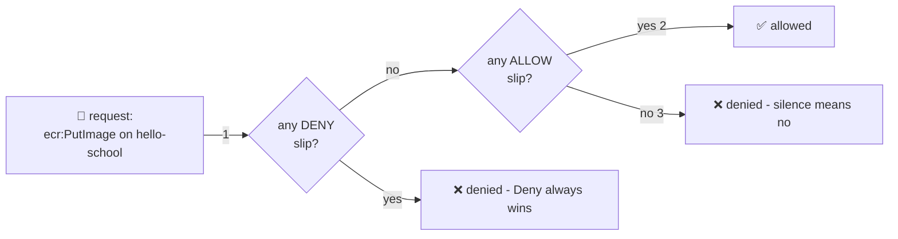

# 📝 Lesson 03 — Policies: reading a permission slip

**📍 You are here:** Lesson **03** of 12 · Previous: `lesson-02-users-groups` · Next: `lesson-04-roles`

---

## 📦 What's in this branch

Lessons 01–02, **plus**: the language of permissions — **policy JSON** — and
the evaluation rules that decide every request. Real file:

- [iam/ecr-push-policy.json](../../iam/ecr-push-policy.json) — a real least-privilege slip, annotated

## 🧒 Explain like I'm 5

A **permission slip** 📝 at school says exactly four things:

1. **Yes or no?** — *"Aarav MAY…"* (`"Effect": "Allow"` — or `"Deny"`).
2. **Do what?** — *"…borrow books…"* (`"Action": "ecr:PutImage"` — always
   `service:Verb`).
3. **With which things?** — *"…from the JUNIOR library only"*
   (`"Resource": "arn:aws:ecr:…:repository/hello-school"` — the thing's
   full address, its **ARN**).
4. **Under what conditions?** — *"…on school days"* (`"Condition"` —
   optional: from this IP, with MFA, before this date…).

And the school's three iron rules when someone tries a door:

- **No slip? NO.** Everything is denied by default. Silence = no.
- **An Allow slip opens the door** — any one is enough.
- **A Deny slip SLAMS it** — an explicit Deny beats any number of Allows.
  (That's how the school says "interns may do everything EXCEPT the safe".)

Least privilege (the office motto): write slips for **exact verbs on exact
things**, not *"may do everything everywhere"* (`"Action": "*", "Resource": "*"` —
that's AdministratorAccess, the photocopied master key with extra steps).

## 🗺️ Diagram



## ❓ What

- **ARN** = Amazon Resource Name, the full address of any thing:
  `arn:aws:ecr:ap-south-1:123456789012:repository/hello-school`
  (partition:service:region:account:thing).
- **Managed policies** (AWS-made or yours, reusable, versioned) vs **inline**
  (glued to one identity — for true one-offs).
- Wildcards: `ecr:Get*` (all the Get verbs), `Resource: "*"` (everything) —
  each `*` is a trade of safety for convenience. Spend them consciously.
- [iam/ecr-push-policy.json](../../iam/ecr-push-policy.json) shows the real
  shape: `GetAuthorizationToken` needs `*` (it's account-wide by nature),
  but the push verbs are pinned to ONE repository.

## 🤔 Why

Every AccessDenied you will ever debug, every security review, every "can
CI really only push to ECR?" — it all comes down to reading these four
fields fluently. This is the grammar; lessons 04–05 are just about *who
carries the slips*.

## 🧪 Try it (free)

```bash
# read AWS's own slips — how the pros phrase things:
aws iam get-policy-version --policy-arn arn:aws:iam::aws:policy/AmazonEC2ReadOnlyAccess \
  --version-id v1 --query 'PolicyVersion.Document.Statement[0]'

# TEST a slip without doing anything real — the policy simulator:
aws iam simulate-custom-policy \
  --policy-input-list "$(cat iam/ecr-push-policy.json)" \
  --action-names ecr:PutImage ecr:DeleteRepository \
  --resource-arns arn:aws:ecr:ap-south-1:123456789012:repository/hello-school \
  --query 'EvaluationResults[].{action:EvalActionName,result:EvalDecision}'
# → PutImage: allowed · DeleteRepository: implicitDeny (no slip = no!) 🎉
```

## ✅ Verify — what you should see

the policy simulator (`aws iam simulate-principal-policy`) returns **allowed** for the one action you granted and **implicitDeny** for a neighbour — silence is a NO.

## 🧹 Clean up — do not leave running

nothing to clean up — this lesson is free 🎉

## ⚠️ Common mistakes

- `"Resource": "*"` because the ARN was annoying to find
- forgetting an explicit Deny beats every Allow — the door stays slammed
- debugging AccessDenied by adding Admin* 'temporarily'

## ⏭️ Next

Slips attached to people is half the story. The other half wears hats:
**roles** — identities anyone (or anything) approved can temporarily become.

```bash
git checkout lesson-04-roles
```
