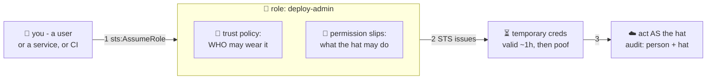

# 🎩 Lesson 04 — Roles: hats, not people

**📍 You are here:** Lesson **04** of 12 · Previous: `lesson-03-policies` · Next: `lesson-05-machine-identities`

---

## 📦 What's in this branch

Lessons 01–03, **plus** the most important IAM idea after policies:
**roles** — wearable identities with an expiry timer. Real file:

- [iam/ec2-role-trust-policy.json](../../iam/ec2-role-trust-policy.json) — a real "who may wear this hat" document

## 🧒 Explain like I'm 5

The school keeps special **hats** 🎩 on a stand by the office:

- the **"substitute teacher"** hat — whoever wears it may take attendance
  and use the staff room;
- the **"exam invigilator"** hat — whoever wears it may open the exam
  cupboard, *during exams only*.

The hats are **not people**. They have no password, no home. Two documents
hang from each hat:

1. **Who may wear it** 🤝 — the **trust policy**. "Any teacher may wear the
   substitute hat." "Only the EC2 service may put hats on desks."
2. **What the wearer may do** 📝 — normal permission slips from lesson 03.

Putting a hat on = **AssumeRole**. The office (STS) hands you **temporary
credentials** ⏳ — they work for about an hour, then dissolve into nothing.
And the logbook is beautiful: *"Sita, wearing exam-invigilator, opened the
cupboard at 10:02."* Person AND hat, always.

Why hats beat handing Sita the permissions directly? Because the powers live
with the *job*, not the person: give the hat to whoever does the job today,
audit the hat's powers in one place, and NOTHING long-lived exists to steal.

## 🗺️ Diagram



## ❓ What

- **Role** = identity with permissions but no credentials of its own.
  **Trust policy** answers "who may assume it" (a user, an account, a
  service like `ec2.amazonaws.com`, or a federated login).
- **STS** (Security Token Service) mints the temporary key+secret+token
  triple; default 1 hour, configurable.
- Roles are how *everything non-human* works in AWS — and also how humans
  do sensitive things ("assume the prod-admin role for this task" instead
  of walking around with prod powers all day).
- Cross-account access = a role in account B trusting account A. No shared
  users, ever.

## 🤔 Why

Temporary beats permanent: a leaked 1-hour credential is a bad afternoon; a
leaked permanent key is a crypto-mining bill and an incident report. Roles
also *separate the job from the person* — the exact trick groups did for
humans, extended to machines and moments.

## 🧪 Try it (free)

```bash
ACCOUNT=$(aws sts get-caller-identity --query Account --output text)

# a hat that trusts YOU (your own account):
cat > /tmp/trust.json <<EOF
{"Version":"2012-10-17","Statement":[{"Effect":"Allow",
 "Principal":{"AWS":"arn:aws:iam::${ACCOUNT}:root"},"Action":"sts:AssumeRole"}]}
EOF
aws iam create-role --role-name lab-hat --assume-role-policy-document file:///tmp/trust.json
aws iam attach-role-policy --role-name lab-hat \
  --policy-arn arn:aws:iam::aws:policy/AmazonEC2ReadOnlyAccess

# put the hat on:
aws sts assume-role --role-arn arn:aws:iam::${ACCOUNT}:role/lab-hat \
  --role-session-name trying-hats --query 'Credentials.Expiration'
# → an expiry timestamp ~1h away. THAT's the whole magic. ⏳

# who may wear the EC2 hat in this repo? read the real file:
cat iam/ec2-role-trust-policy.json    # Principal: ec2.amazonaws.com (lesson 05!)

# cleanup:
aws iam detach-role-policy --role-name lab-hat --policy-arn arn:aws:iam::aws:policy/AmazonEC2ReadOnlyAccess
aws iam delete-role --role-name lab-hat
```

## ✅ Verify — what you should see

`aws sts assume-role` returns credentials with an `Expiration` about an hour away; `get-caller-identity` afterwards shows the **role** ARN, not your user.

## 🧹 Clean up — do not leave running

nothing to clean up — this lesson is free 🎉

## ⚠️ Common mistakes

- a trust policy that lets `*` assume the role — the hat anyone can wear
- pasting the temporary credentials into a config file (they expire; that's the point)
- role-chaining three deep and then wondering who did what — read CloudTrail

## ⏭️ Next

Hats on ROBOTS: how EC2 instances and CI pipelines get powers with no
passwords anywhere — the pattern all three other courses quietly used.

```bash
git checkout lesson-05-machine-identities
```
