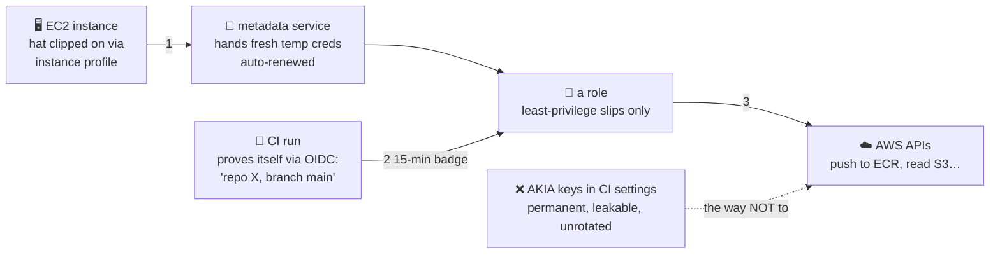

# 🤖 Lesson 05 — Machine identities: badges for robots, keys for nobody

**📍 You are here:** Lesson **05** of 12 · Previous: `lesson-04-roles` · Next: `lesson-06-iam-hygiene`

---

## 📦 What's in this branch

Lessons 01–04, **plus**: how machines authenticate — the pattern that
removes long-lived secrets from your infrastructure. Real files:

- [iam/ec2-role-trust-policy.json](../../iam/ec2-role-trust-policy.json) — the EC2 hat's trust document
- [iam/ecr-push-policy.json](../../iam/ecr-push-policy.json) — the exact slips a CI robot needs

## 🧒 Explain like I'm 5

Robots work at the school too: the **desk-computers** (EC2) and the
**courier** (CI). Should they carry passwords? 😬 Robots lose things,
their pockets get photographed (logs! repos!), and nobody rotates a robot's
password. So the school does something smarter — **badges, issued fresh
every hour** 🪪🤖:

- **A desk-computer's badge**: when a desk is set up, the office clips a
  *hat* to it (an **instance profile** — lesson 04's hat, mounted on
  hardware). Inside the desk there's a little slot (the **metadata
  service**) where the machine can always find *today's fresh badge* —
  temporary credentials, auto-renewed. The k8s course's EKS nodes pull from
  ECR **exactly** this way. No keys. Ever.

- **The courier's badge (OIDC)**: the courier arrives claiming "I'm the CI
  run for BaluRaut/learn-docker-school, main branch". AWS phones the
  courier company (GitHub/CircleCI's OIDC issuer) — *"is this robot really
  yours, on that branch?"* — and only then hands over a 15-minute badge for
  ONE specific hat. Nothing stored in CI settings at all.

- **The anti-pattern** ❌: minting an IAM user with permanent `AKIA…` keys
  and pasting them into CI. It works — and it's the #1 way AWS accounts get
  compromised. Leaked once (a log, a fork, a screenshot), valid forever.

## 🗺️ Diagram



## ❓ What

- **Instance profile** = the mechanical clip that mounts an IAM role onto an
  EC2 instance ([ec2/ec2.tf](../../ec2/ec2.tf) wires ours). The SDK/CLI
  inside the instance finds credentials automatically — code needs zero
  config.
- **OIDC federation** = AWS trusts an external identity provider's signed
  tokens. GitHub Actions' `role-to-assume` (Docker course, lesson 12) is
  this. CircleCI supports it too.
- The chain of least privilege: trust policy narrows WHO (this repo, this
  branch!) + permission policy narrows WHAT
  ([ecr-push-policy.json](../../iam/ecr-push-policy.json): one repo, push
  verbs only).

## 🤔 Why

Count the passwords in a well-built AWS setup: root (locked away), your SSO
login… and that's it. No server credentials, no CI secrets, no config-file
keys. Every machine identity is a hat + a fresh badge. This single pattern
retires the most common breach class in cloud history.

## 🧪 Try it (free — paper lab + one real check)

```bash
# see whether any permanent keys exist in your account (goal: none/minimal):
aws iam list-users --query 'Users[].UserName' --output text | tr '\t' '\n' | while read u; do
  aws iam list-access-keys --user-name "$u" \
    --query "AccessKeyMetadata[].[UserName,AccessKeyId,Status,CreateDate]" --output text
done
# every AKIA line: ask "could this be a role instead?" (usually: yes)

# read the two real documents in this repo and say aloud what each allows:
cat iam/ec2-role-trust-policy.json     # WHO may wear the hat
cat iam/ecr-push-policy.json           # WHAT the wearer may do
# (lesson 12 of Part 2 mounts this hat on a real instance — and you'll
#  curl the metadata service from inside it!)
```

## ⏭️ Next

Part 1 closes with the poster on the ID-office wall: the **hygiene
checklist** that prevents the most common AWS security mistakes.

```bash
git checkout lesson-06-iam-hygiene
```
