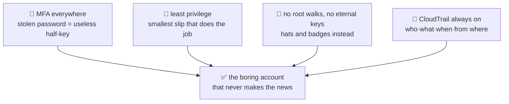

# 📋 Lesson 06 — IAM hygiene: the ID-office rules poster

**📍 You are here:** Lesson **06** of 12 — end of Part 1! · Previous: `lesson-05-machine-identities` · Next: `lesson-07-what-is-ec2`

---

## 📦 What's in this branch

Lessons 01–05, **plus** the four habits that prevent most AWS security
incidents — the poster on the ID-office wall.

## 🧒 Explain like I'm 5

Four rules, big letters, taped where everyone queues for cards:

1. **📱 Two locks on every door that matters (MFA).** A card alone isn't
   enough — you also show *the thing only you carry* (your phone). A stolen
   password becomes a useless half-key. Root: MFA. Every human: MFA.
   No exceptions, no "later".

2. **🤏 The smallest slip that does the job (least privilege).** The kid
   watering plants gets the garden-tap slip — not the master key "to be
   safe". Start narrow; widen when a real denial says you must. Going the
   other direction (start with `AdministratorAccess`, promise to tighten
   later) has never once ended in tightening. 😅

3. **🚫 No master key walks the halls; no eternal spare keys.** Root stays
   in the safe (lesson 01). And permanent `AKIA…` keys — the "spare keys
   under the doormat" — get hunted down and replaced with hats (lessons
   04–05). The ones that must exist get rotated and get usage-checked.

4. **🧾 The logbook is always on (CloudTrail).** Every door opened, every
   card shown, written down: who, what, when, from where. Not to spy — so
   that "what happened at 2 AM?" has an ANSWER instead of a shrug. Turn it
   on once, account-wide, forget it until the day it saves you.

## 🗺️ Diagram



## ❓ What (the audit tools that come with the office)

- **Credential report** — one CSV: every user, key ages, MFA status.
- **Access Advisor** — "this user has S3 powers but hasn't used them in
  400 days" → shrink the slip.
- **IAM Access Analyzer** — finds resources shared wider than intended.
- **CloudTrail** — the API logbook (90 days of event history free in the
  console; a trail to S3 for keeps).

## 🤔 Why

Every AWS incident postmortem you'll ever read features at least one of:
no MFA, an over-broad policy, a leaked permanent key, or "we couldn't tell
what happened" (no trail). Four rules, four antidotes. Boring is the goal —
boring accounts don't make the news.

## 🧪 Try it (free — audit yourself)

```bash
# 1) the credential report — your account's report card:
aws iam generate-credential-report && sleep 2
aws iam get-credential-report --query Content --output text | base64 -d | cut -d, -f1,4,8,9 | column -t -s,
# look for: mfa_active=false on humans 😬, ancient access_key_1_last_rotated

# 2) is the logbook on?
aws cloudtrail describe-trails --query 'trailList[].{Name:Name,MultiRegion:IsMultiRegionTrail}'
# empty? → create a trail (console, 2 minutes) before Part 2.

# 3) recent history exists even without a trail (90 days):
aws cloudtrail lookup-events --max-results 3 \
  --query 'Events[].{when:EventTime,who:Username,what:EventName}'
```

## ⏭️ Next — Part 2 begins 🖥️

Identity solved. Now the OTHER foundation: the rented computers everything
runs on. What actually IS an EC2 instance?

```bash
git checkout lesson-07-what-is-ec2
```
