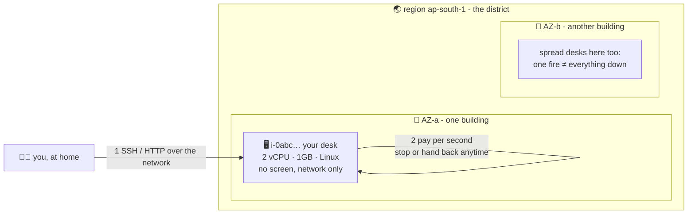

# 🖥️ Lesson 07 — What is EC2: a rented desk-computer with no screen

**📍 You are here:** Lesson **07** of 12 — Part 2 begins! · Previous: `lesson-06-iam-hygiene` · Next: `lesson-08-types-pricing`

---

## 📦 What's in this branch

Lessons 01–06, **plus**: demystifying the thing everything runs on — the
**EC2 instance**. Real file:

- [ec2/ec2.tf](../../ec2/ec2.tf) — one complete rented computer as code (used through all of Part 2)

## 🧒 Explain like I'm 5

Amazon runs gigantic **study halls** 🏫 full of computers — millions of
desks in buildings around the world. **EC2** is the rental counter:

> *"One desk please. Small one. Linux. I'll pay by the second and hand it
> back whenever."* — and ~40 seconds later, a desk is yours.

The desk (**instance**) is a real computer: CPU, RAM, a disk, Linux. Three
things make it different from the laptop in front of you:

1. **No screen, no keyboard.** 🚫🖥️ You talk to it *only* over the network
   (SSH, HTTP — lessons 09–10). "A server is a rented Linux computer
   without a screen" — the before-you-start guide said it; now it's yours.
2. **It lives in a specific place.** A **region** (school district —
   `ap-south-1` = Mumbai) containing **availability zones** (separate
   buildings with separate power). Serious setups spread desks across
   buildings, so one fire ≠ everything down.
3. **It's disposable on purpose.** Rent, use, hand back. The whole cloud
   mindset in one habit: desks are *cattle, not pets* — the same lesson
   pods taught in the k8s course, one layer down.

## 🗺️ Diagram



## ❓ What

- **Instance** = virtual machine on AWS's hardware. **AMI** = what it boots
  from (lesson 11). **Instance type** = its size (lesson 08).
- Lifecycle: `running` (billing!) → `stopped` (CPU billing off, disk still
  billed pennies) → `terminated` (gone). Stop ≠ terminate.
- Where the other courses meet it: every **EKS node** in the k8s course is
  an EC2 instance; the "$73/month + EC2 nodes" line item is literally these
  desks. Fargate/Lambda are AWS renting-and-hiding the desks for you.

## 🤔 Why

You can use EKS without understanding pods — badly. Same with AWS and EC2:
bills, incidents, capacity, "why is my node NotReady" — it all bottoms out
at some rented desk somewhere. Part 2 makes that desk boring and knowable.

## 🧪 Try it (~10 minutes, ~1¢)

```bash
# rent one desk, fully wired (SG + role + boot script), from this repo:
cd ec2 && terraform init
terraform apply -var my_ip=$(curl -s ifconfig.me)/32     # review, type yes

# what did we just rent?
aws ec2 describe-instances --filters Name=tag:Name,Values=school-desk \
  --query 'Reservations[].Instances[].{id:InstanceId,type:InstanceType,az:Placement.AvailabilityZone,state:State.Name,ip:PublicIpAddress}'

# it's already a web server (lesson 12 explains how):
curl http://$(terraform output -raw public_ip)

# 🧹 THE LAB RULE — always, before you leave:
terraform destroy -var my_ip=$(curl -s ifconfig.me)/32
```

## ✅ Verify — what you should see

`aws ec2 describe-instances` shows `running`; `curl http://PUBLIC_IP` returns the welcome page from user-data.

## 🧹 Clean up — do not leave running

`terraform destroy` — then `describe-instances` must show **terminated** (a stopped desk still bills its drawer)

## ⚠️ Common mistakes

- forgetting the desk overnight — the ~1¢/hour that becomes $7
- stop instead of terminate, then paying for the EBS drawer forever
- picking a region far from you and wondering why SSH lags

## ⏭️ Next

Desks come in sizes and payment plans — scooters, trucks, season tickets
and standby seats. Choosing wisely is where the money is.

```bash
git checkout lesson-08-types-pricing
```
