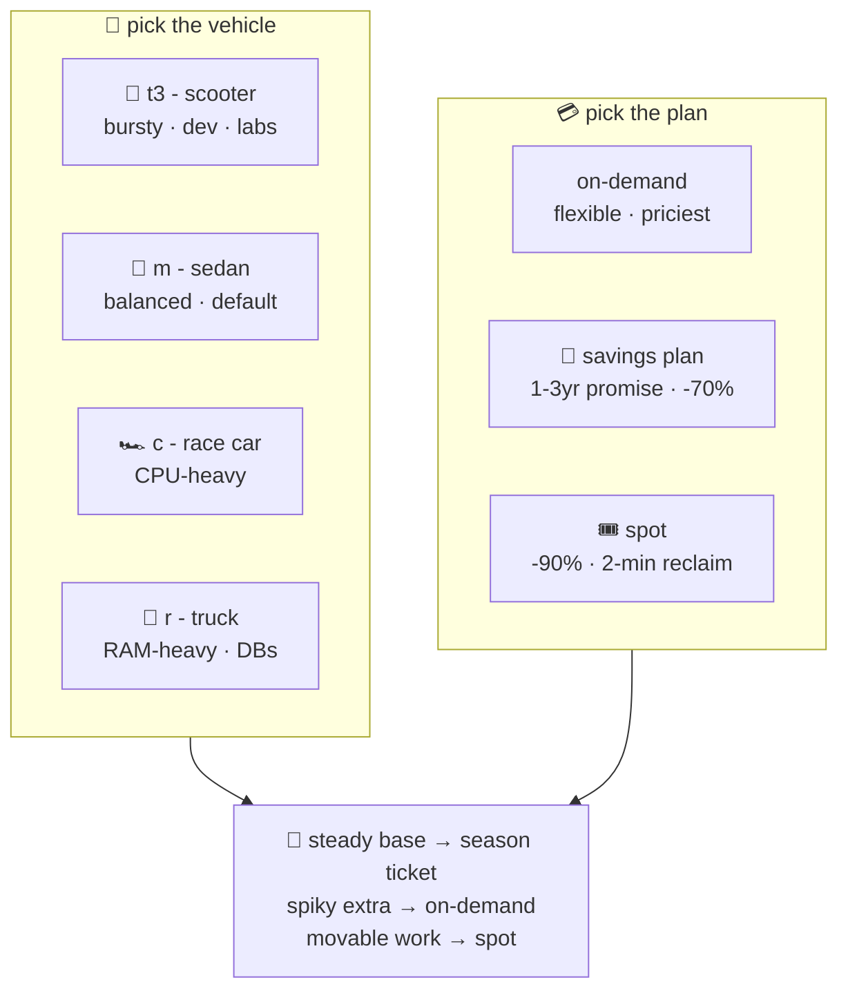

# 🛵 Lesson 08 — Types & pricing: scooters, trucks, and standby seats

**📍 You are here:** Lesson **08** of 12 · Previous: `lesson-07-what-is-ec2` · Next: `lesson-09-connecting`

---

## 📦 What's in this branch

Lessons 01–07, **plus**: reading instance-type names fluently and choosing
a payment plan — the two decisions behind every AWS bill.

## 🧒 Explain like I'm 5

**Picking the vehicle** 🚗 — the rental counter's garage, by errand:

- **🛵 t-family (t3.micro…)** — scooters: cheap, zippy for short bursts,
  wheezy under constant load ("burstable"). Dev boxes, small sites, labs —
  ours is a t3.micro.
- **🚗 m-family** — sedans: balanced CPU/RAM. The default guess for normal
  apps; EKS node groups often live here (the k8s course used t3.small to
  stay cheap).
- **🏎️ c-family** — race cars: lots of CPU per GB. Encoding, compiling,
  number-crunching.
- **🚚 r-family** — moving trucks: lots of RAM per CPU. Databases, caches.

Reading a name: `t3.micro` = family `t`, generation `3`, size `micro`.
Bigger size = exactly doubled: `large` → `xlarge` → `2xlarge`…

**Picking the payment plan** 💳 — same desk, three prices:

- **On-demand**: pay per second, leave anytime. Flexible, most expensive.
- **Savings plan / reserved** 🎫: a *season ticket* — promise 1–3 years of
  use, save up to ~70%. For the load you KNOW you'll have.
- **Spot** 🎟️: a *standby seat* — up to ~90% off, but if a full-fare
  customer arrives, you're asked to leave **with a 2-minute warning**.
  Sounds scary — is a superpower for work that can move desks (and k8s
  pods, lesson 03 of the ☸️ course, can ALWAYS move desks…).

## 🗺️ Diagram



## ❓ What

- Suffixes you'll meet: `g` = Graviton/ARM (cheaper per unit of work — try
  it), `d` = local NVMe disk, `n` = extra network.
- **Burst credits**: t-family banks credits while idle, spends them under
  load. Great for spiky little things; wrong for sustained 100% CPU.
- The bill's other lines: EBS disks (lesson 11), data transfer OUT, and
  NAT gateways (ask the k8s course's cost warning why 😄).
- Real-world fleet shape: a savings-plan base + on-demand headroom + spot
  for the interruptible bulk. Managed node groups in EKS mix exactly this
  way.

## 🤔 Why

Instance choice IS cost engineering: the same workload can cost 5× more on
mismatched types and lanes. And spot is the honest test of cloud-native
discipline — if your app can't survive losing a desk with 2 minutes'
notice, lessons 02–03 of the k8s course have homework for you.

## 🧪 Try it (free — window shopping)

```bash
# what does a t3.micro actually give you?
aws ec2 describe-instance-types --instance-types t3.micro t3.small m5.large \
  --query 'InstanceTypes[].{type:InstanceType,vcpu:VCpuInfo.DefaultVCpus,memMiB:MemoryInfo.SizeInMiB}' --output table

# today's spot discount in your region (compare with on-demand ~$0.01/hr for t3.micro):
aws ec2 describe-spot-price-history --instance-types t3.micro \
  --product-descriptions "Linux/UNIX" --max-items 3 \
  --query 'SpotPriceHistory[].{az:AvailabilityZone,price:SpotPrice}' --output table

# your account's current desk count (should be 0 after lesson 07's destroy!):
aws ec2 describe-instances --query 'Reservations[].Instances[].State.Name' --output text | sort | uniq -c
```

## ⏭️ Next

You rented the desk — now walk up to it: **key pairs, SSH, and the modern
no-open-door way (SSM)**.

```bash
git checkout lesson-09-connecting
```
