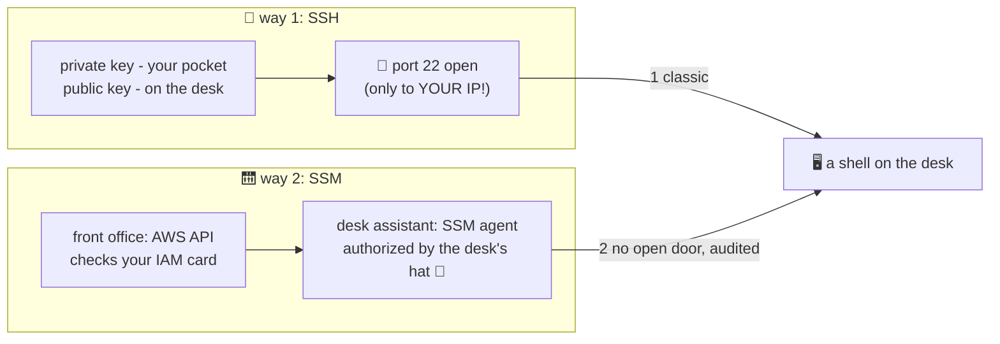

# 🔑 Lesson 09 — Connecting: the door key vs the escorted visit

**📍 You are here:** Lesson **09** of 12 · Previous: `lesson-08-types-pricing` · Next: `lesson-10-security-groups`

---

## 📦 What's in this branch

Lessons 01–08, **plus**: getting a shell on your desk — the classic way
(**SSH + key pairs**) and the modern way (**SSM Session Manager**).

## 🧒 Explain like I'm 5

Your desk has no screen — so how do you *sit at it*? Two ways into the
building:

**Way 1 — the door key** 🔑 (SSH). When renting the desk you hand AWS a
**padlock** (your *public* key); AWS bolts it to the desk. The matching
**key** (your *private* key) never leaves your pocket. Show up at door 22,
your key fits your padlock, you're in.

Fine print that bites people:
- Lose the private key → nobody can let you in (no "forgot password").
- Share it with a teammate → lesson 01's shared-card disease returns.
- And door 22 must be *open* to you (a guest-list entry — lesson 10),
  which is one more door the whole internet loves to knock on.

**Way 2 — the escorted visit** 🛗 (SSM Session Manager). No open door at
all. You ask the *front office* (AWS's API, checking your IAM card); the
office phones the desk's built-in **assistant** (the SSM agent, which the
desk's *hat* from lesson 05 authorizes); the assistant walks you in through
the staff corridor. No port, no key file, and the logbook records the whole
visit — keystrokes included, if the school wants.

Modern default: **SSM**. SSH remains great for quick personal labs (locked
to YOUR IP) and file-copy-heavy workflows.

## 🗺️ Diagram



## ❓ What

- **Key pair** = asymmetric crypto: public key (shareable, on instance),
  private key (secret, yours). AWS never has your private key.
- **SSM needs**: the agent (pre-installed on Amazon Linux) + the instance
  role allowing SSM (`AmazonSSMManagedInstanceCore`) + your IAM permission.
  Notice: *both* sides authorize via IAM — Part 1 pays off.
- SSM bonuses: works on desks with **no public IP**, replaces bastion
  hosts, port-forwards through the corridor, sessions loggable.

## 🤔 Why

"Open port 22 to the world + shared pem file" is the most attacked doorway
on the internet — every scanner on Earth knocks within minutes. The
IAM-checked, no-open-door path is what security teams mean by "zero
inbound". Knowing both, you'll pick correctly per situation.

## 🧪 Try it (~10 min, ~1¢)

```bash
cd ec2 && terraform apply -var my_ip=$(curl -s ifconfig.me)/32   # desk up (lesson 07)

# --- way 2 first: SSM, no key, no open door needed ---
aws ssm start-session --target $(aws ec2 describe-instances \
  --filters Name=tag:Name,Values=school-desk Name=instance-state-name,Values=running \
  --query 'Reservations[0].Instances[0].InstanceId' --output text)
# you're IN. try:  hostname ; whoami ; exit
# (works because ec2.tf attached AmazonSSMManagedInstanceCore to the desk's hat? —
#  if the session refuses: that's your homework, add it to the role 😉)

# --- way 1: classic SSH (needs a key pair added to ec2.tf as an exercise) ---
# ssh -i my-key.pem ec2-user@$(terraform output -raw public_ip)

# 🧹 the lab rule:
terraform destroy -var my_ip=$(curl -s ifconfig.me)/32
```

## ✅ Verify — what you should see

`aws ssm start-session --target i-…` drops you into a shell with **no port 22 open** in the security group.

## 🧹 Clean up — do not leave running

`terraform destroy`; delete the key pair if you created one for comparison

## ⚠️ Common mistakes

- port 22 open to 0.0.0.0/0 — the classic honeypot
- one team-shared private key file
- SSM 'not working' because the instance role lacks the SSM policy — it's IAM, not networking

## ⏭️ Next

That "only from YOUR IP" door rule deserves its own lesson: **security
groups** — the gatekeeper's guest list.

```bash
git checkout lesson-10-security-groups
```
