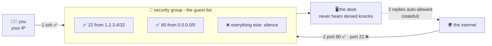

# 🚪 Lesson 10 — Security groups: the gatekeeper's guest list

**📍 You are here:** Lesson **10** of 12 · Previous: `lesson-09-connecting` · Next: `lesson-11-ebs-snapshots-ami`

---

## 📦 What's in this branch

Lessons 01–09, **plus**: the per-desk firewall — **security groups** — and
the three rules that make them click. Real file:

- [ec2/ec2.tf](../../ec2/ec2.tf) — the `aws_security_group` block, annotated

## 🧒 Explain like I'm 5

Every desk gets a **gatekeeper** 🧍 who checks a **guest list** before any
knock reaches the desk. Ours (from [ec2.tf](../../ec2/ec2.tf)) reads:

> ✅ door **22** (SSH) — *only* visitors from **my house** (`1.2.3.4/32`)
> ✅ door **80** (web) — visitors from **anywhere** (`0.0.0.0/0`)
> ❌ any other door — **not on the list = silence.**

Three habits of this gatekeeper:

1. **The default answer is silence.** 🤫 No inbound list entry = the desk
   never even *hears* the knock. You open doors explicitly; you can't
   forget to close a door you never opened.
2. **He remembers conversations** (stateful). If he let a request IN, he
   lets its *reply* back OUT automatically — no mirror rules needed.
3. **He can recognize other gatekeepers.** A rule may say "allow 5432 from
   anyone wearing the `app-sg` badge" — groups referencing groups. That's
   how "only the app desks may talk to the database desks" is written
   without a single IP address. (The k8s course's ALB → node wiring works
   exactly like this.)

## 🗺️ Diagram



## ❓ What

- **Security group** = stateful, instance-level, allow-only. Attached to
  the instance's network interface; editable live (changes apply
  instantly — no reboot).
- **CIDR notation**: `1.2.3.4/32` = exactly one address; `0.0.0.0/0` =
  everyone. `/24` = 256 addresses. The `/number` says how many leading bits
  are fixed.
- **NACLs** (the OTHER firewall): subnet-level, stateless, has Deny rules —
  the *building's* fence vs the desk's gatekeeper. Default NACL passes
  everything; most teams shape traffic with SGs and leave NACLs alone.
- The classic sin: `22 from 0.0.0.0/0` — SSH open to Earth. Scanners find
  it in minutes. (Our tf makes you pass YOUR IP on purpose.)

## 🤔 Why

SGs are the cheapest security you'll ever deploy: default-deny plus
explicit doors removes whole attack classes before any software runs. And
group-references make intent readable — "db accepts app-sg" *documents*
the architecture in the firewall itself.

## 🧪 Try it (~10 min, ~1¢)

```bash
cd ec2 && terraform apply -var my_ip=$(curl -s ifconfig.me)/32

IP=$(terraform output -raw public_ip)
curl -m 5 http://$IP                    # door 80: open to all → answers 🎉
nc -zv -w 5 $IP 22                      # door 22 from YOUR IP → open
nc -zv -w 5 $IP 3306                    # random door → TIMEOUT, not "refused":
                                        # the gatekeeper never even answered 🤫

# see the live guest list:
aws ec2 describe-security-groups --filters Name=group-name,Values=school-desk-sg \
  --query 'SecurityGroups[0].IpPermissions[].{port:FromPort,from:IpRanges[0].CidrIp}'

# feel "changes apply instantly": remove the port-80 ingress in ec2.tf,
# terraform apply, curl again → silence. put it back. 😈

terraform destroy -var my_ip=$(curl -s ifconfig.me)/32     # 🧹
```

## ✅ Verify — what you should see

`nc -zv PUBLIC_IP 80` connects; `nc -zv PUBLIC_IP 22` from a different IP times out (silence, not refusal).

## 🧹 Clean up — do not leave running

`terraform destroy`

## ⚠️ Common mistakes

- allowing 0.0.0.0/0 on every port 'to make it work'
- expecting outbound rules to block replies — SGs are stateful
- two SGs referencing each other and forgetting which one is the reception's

## ⏭️ Next

What happens to the desk's *stuff* when the desk goes away? Drawers,
photocopies, and desk templates: **EBS, snapshots & AMIs**.

```bash
git checkout lesson-11-ebs-snapshots-ami
```
