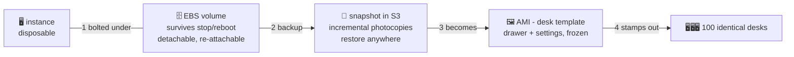

# 🗄️ Lesson 11 — EBS, snapshots & AMIs: drawer, photocopy, desk template

**📍 You are here:** Lesson **11** of 12 · Previous: `lesson-10-security-groups` · Next: `lesson-12-ec2-in-real-life`

---

## 📦 What's in this branch

Lessons 01–10, **plus**: what survives what — the storage story of EC2.
Real file:

- [ec2/ec2.tf](../../ec2/ec2.tf) — the `root_block_device` (8GB drawer) and the AMI lookup

## 🧒 Explain like I'm 5

Three pieces of furniture, three lifespans:

1. **The drawer** 🗄️ (**EBS volume**) — bolted under the desk, holds all
   your files. **Stop** the desk (lunch break): drawer stays. **Reboot**:
   drawer stays. It's real network-attached storage with a life of its own —
   it can even be unbolted and attached under a *different* desk.
   (Recognize it? The k8s course's PersistentVolumes on EKS ARE these
   drawers — `PVC → EBS`, literally.)

2. **The photocopy** 📸 (**snapshot**) — a copy of the drawer's contents
   filed in the archive (S3). Incremental: the second photocopy only copies
   *changed pages*. Drawer dies, region hiccups, you fat-finger `rm -rf`?
   Restore a new drawer from the photocopy. This is the backup story.

3. **The desk template** 🖼️ (**AMI**) — a *whole desk*, frozen: drawer
   contents + settings. From one template, stamp out 1 or 100 **identical**
   desks. `ec2.tf` boots from Amazon's `al2023` template; companies bake
   their own ("our base desk: patched, agents installed, logo wallpaper").

Sound familiar? **AMI : instance = image : container** — the Docker
course's lunchbox story, just heavier furniture. 🍱→🖥️

One trapdoor: some desks have a built-in scratch shelf (**instance store**)
that is **wiped when the desk stops**. Fast, fine for temp files — never
for anything you love.

## 🗺️ Diagram



## ❓ What

- **EBS**: network-attached block storage, billed per GB-month
  (~$0.08/GB for gp3 — our 8GB drawer ≈ 64¢/month *even when stopped*;
  terminate deletes it by default).
- **Snapshot**: incremental, cross-AZ by nature, copyable across regions —
  the DR building block. Automate with lifecycle policies (Data Lifecycle
  Manager) — janitors again! 🧹
- **AMI** = snapshot(s) + launch metadata. Region-scoped; copyable.
  "Golden AMI" pipelines bake patched templates on a schedule.
- **Instance store** = physically-attached NVMe scratch: fastest, and
  gone on stop. Read the type sheet before trusting a disk.

## 🤔 Why

This is the cattle-vs-pets line drawn through storage: desks disposable,
drawers durable, photocopies for disasters, templates for fleets. Every
"we lost data" story is someone confusing one lifespan for another —
usually instance store for a drawer, or "the AMI is basically a backup"
(it isn't; snapshots are).

## 🧪 Try it (~10 min, ~1¢)

```bash
cd ec2 && terraform apply -var my_ip=$(curl -s ifconfig.me)/32

# meet the drawer:
VOL=$(aws ec2 describe-instances --filters Name=tag:Name,Values=school-desk \
  --query 'Reservations[0].Instances[0].BlockDeviceMappings[0].Ebs.VolumeId' --output text)
aws ec2 describe-volumes --volume-ids $VOL \
  --query 'Volumes[0].{size:Size,type:VolumeType,az:AvailabilityZone}'

# photocopy it:
SNAP=$(aws ec2 create-snapshot --volume-id $VOL --description "lesson-11 photocopy" \
  --query SnapshotId --output text)
aws ec2 describe-snapshots --snapshot-ids $SNAP --query 'Snapshots[0].{state:State,progress:Progress}'

# which template did we boot from?
aws ec2 describe-instances --filters Name=tag:Name,Values=school-desk \
  --query 'Reservations[0].Instances[0].ImageId'

# 🧹 cleanup — desk AND photocopy:
terraform destroy -var my_ip=$(curl -s ifconfig.me)/32
aws ec2 delete-snapshot --snapshot-id $SNAP
```

## ✅ Verify — what you should see

after stop/start the file you wrote in the EBS volume is still there; `aws ec2 describe-snapshots --owner-ids self` lists your photocopy.

## 🧹 Clean up — do not leave running

`terraform destroy`, then **delete the snapshot and deregister the AMI** — orphan photocopies bill by the GB-month

## ⚠️ Common mistakes

- assuming instance store survives a stop — it doesn't
- snapshots piling up with no lifecycle — check `describe-snapshots` monthly
- an AMI baked with secrets inside (lesson 06 applies to images too)

## ⏭️ Next

The finale: desks that set THEMSELVES up, badge themselves, and multiply
into fleets — and the moment you recognize EKS nodes for what they are.

```bash
git checkout lesson-12-ec2-in-real-life
```
