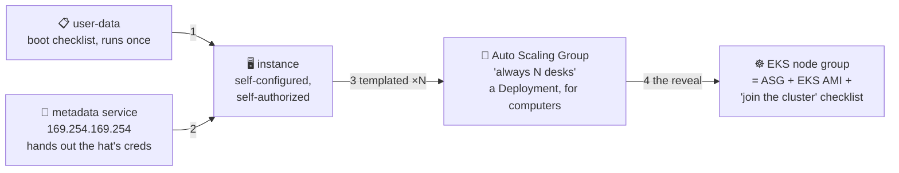

# 🤖 Lesson 12 — EC2 in real life: checklists, badges, and fleets

**📍 You are here:** Lesson **12** of 12 — the final lesson! · Previous: `lesson-11-ebs-snapshots-ami`

---

## 📦 What's in this branch

All 12 lessons — the complete course. The finale ties IAM and EC2 into one
machine, then reveals what you've been renting all along in the other
courses. Real files:

- [ec2/user-data.sh](../../ec2/user-data.sh) — the boot checklist
- [ec2/ec2.tf](../../ec2/ec2.tf) — where the checklist and the hat get attached

## 🧒 Explain like I'm 5

Three tricks turn one hand-tended desk into a self-running fleet:

1. **The boot checklist** 📋 (**user-data**). Taped to every new desk:
   *"on first start: install nginx, put up the welcome page, start
   serving."* The desk sets ITSELF up — that's why lesson 07's instance
   was a web server before you ever touched it. No human, no drift, and
   the checklist lives in git ([user-data.sh](../../ec2/user-data.sh)).

2. **The badge slot** 🎩 (**metadata service**). Inside every desk, at the
   magic address `169.254.169.254`, is a little drawer the machine can ask:
   *"who am I? what's my IP? …and may I have today's credentials?"* —
   fresh temporary creds for the desk's IAM hat (lesson 05, now physical).
   **This is IAM and EC2 shaking hands.** No keys on disk, anywhere.

3. **The fleet manager** 👯 (**Auto Scaling Group**). *"There shall always
   be N desks, built from THIS template, spread across buildings."* Desk
   dies → replaced. Load rises → more desks. Recognize the sentence? It's
   the k8s course's class monitor (lesson 03), one layer down — ASGs are
   Deployments for computers.

And the curtain pull 🎭: an **EKS node group** = an ASG of EC2 desks, baked
from an EKS-flavored AMI, whose user-data says *"join the school cluster"*,
wearing a hat that allows pulling from ECR. Every course you've done was
running on THIS lesson.

## 🗺️ Diagram



## ❓ What

- **user-data**: runs once, as root, on first boot (cloud-init). For big
  setups it shrinks to "install the config agent" or gets baked into a
  golden AMI (lesson 11) — checklist vs pre-set desk, same goal.
- **IMDSv2**: the modern metadata protocol (token first, then ask) — v1's
  open drawer enabled famous breaches. Terraform: `http_tokens = "required"`.
- **ASG** pieces: launch template (which desk), min/desired/max, health
  checks, multi-AZ spread. The HPA↔ASG duet: HPA adds *pods*, and when
  pods no longer fit, the **cluster autoscaler** asks the ASG for *desks*.

## 🤔 Why

This lesson is the course's thesis proved: identity (Part 1) and compute
(Part 2) meet in the metadata drawer, and "cattle, not pets" becomes
mechanical — templates + checklists + fleet managers. From here, the EKS
bill, a NotReady node, or a pod that can't pull from ECR are all things
you can reason about from first principles.

## 🧪 Try it (~10 min, ~1¢ — the grand finale)

```bash
cd ec2 && terraform apply -var my_ip=$(curl -s ifconfig.me)/32

# 1) the checklist already worked:
curl http://$(terraform output -raw public_ip)     # "set up by user-data, no human touched me"

# 2) shake hands with the metadata service FROM INSIDE the desk (via SSM):
aws ssm start-session --target $(aws ec2 describe-instances \
  --filters Name=tag:Name,Values=school-desk Name=instance-state-name,Values=running \
  --query 'Reservations[0].Instances[0].InstanceId' --output text)
# inside the session:
#   TOKEN=$(curl -sX PUT http://169.254.169.254/latest/api/token -H "X-aws-ec2-metadata-token-ttl-seconds: 60")
#   curl -sH "X-aws-ec2-metadata-token: $TOKEN" http://169.254.169.254/latest/meta-data/iam/security-credentials/
#   → school-desk-role   ← the hat, fetched by the machine itself 🎩🤯
#   exit

# 3) 🧹 always:
terraform destroy -var my_ip=$(curl -s ifconfig.me)/32
```

## ✅ Verify — what you should see

terminate one desk in the Auto Scaling Group; within minutes `describe-auto-scaling-groups` shows a replacement — the fleet manager did its job.

## 🧹 Clean up — do not leave running

`terraform destroy` — an ASG left at desired=2 is two desks billing all night

## ⚠️ Common mistakes

- user-data that assumes packages exist — it runs on a fresh box every time
- hand-configuring one instance in an ASG (it will be replaced by a clean one)
- min = desired = max = 1 and calling it high availability

## 🎓 The foundations are laid

IAM: cards, slips, hats, badges. EC2: desks, guest lists, drawers,
templates, fleets. Now re-take the tour with new eyes:

1. 🍱 **[Docker & ECR](https://github.com/BaluRaut/learn-docker-school)** — that 12-hour ECR pass? An IAM badge.
2. ☸️ **[Kubernetes](https://github.com/BaluRaut/learn-kubernetes-school)** — nodes? Your desks, in an ASG.
3. 🤖 **[ArgoCD](https://github.com/BaluRaut/learn-argocd-school)** — "credentials never leave the cluster"? Hats all the way down.

```bash
git checkout main
```
