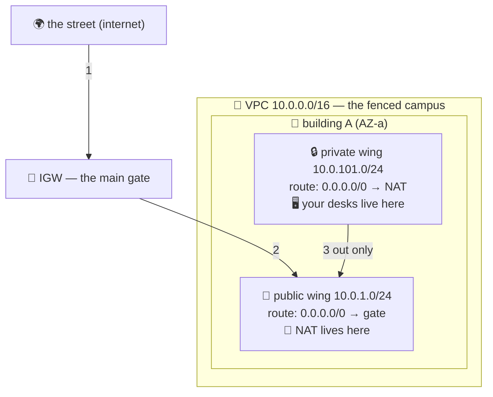

# 🏫 Lesson 13 — VPC: the campus walls

**📍 You are here:** Lesson **13** of 20 — Part 3 begins! · Previous: `lesson-12-ec2-in-real-life` · Next: `lesson-14-s3`

---

## 📦 What's in this branch

Lessons 01–13. Part 3 opens with the thing lessons 7–12 quietly stood on:
the **network** your desks sit inside. Real file:

- [vpc/vpc.tf](../../vpc/vpc.tf) — a whole campus as code: VPC, two subnets, gate, signs

## 🧒 Explain like I'm 5

Where do EC2 desks actually *stand*? Not in an open field — inside a
**fenced campus** with a gate and an address plan. That campus is a **VPC**.

- **The VPC** 🏫 is the fence plus the address plan (the CIDR,
  e.g. `10.0.0.0/16` = "our campus has 65,536 desk numbers").
- **Subnets** 🚪 are wings of the buildings. Each subnet lives in ONE
  building (AZ — lesson 07's buildings!). A **public wing** faces the
  street; a **private wing** has no street-facing windows at all.
- **The Internet Gateway (IGW)** 🚧 is the main gate. Exactly one per
  campus. No gate on your wing's route = you simply cannot reach the street.
- **Route tables** 🪧 are the corridor signs: *"mail for 10.0.0.0/16 →
  stays inside; everything else → the main gate."* A wing is "public"
  ONLY because its sign points at the gate — that's the whole trick.
- **The NAT gateway** 📮 is the one-way postbox in the public wing: kids
  in private wings can mail letters OUT (pull updates, call APIs), but
  strangers can't walk IN. ⚠️ It's the one thing here that costs real
  money every hour — lesson 20 will read you that bill.

Where do your servers go? **Private wings, always.** Only the reception
desk (the load balancer — next lessons) stands in the public wing.

## 🗺️ Diagram



## ❓ What

- **VPC**: your private slice of the region's network — free, invisible
  fence. Every account gets a *default VPC* (that's where lessons 7–12
  ran — you were on a campus all along).
- **Subnet** = CIDR slice + one AZ. Real campuses: one public + one
  private subnet **per AZ**, across 2–3 AZs (the k8s multi-AZ lesson,
  one layer down).
- **Public subnet** = its route table has `0.0.0.0/0 → igw`. Nothing else
  makes it public. Instances there also need a public IP.
- **NAT gateway**: managed, per-AZ, ~$32/month + per-GB. The classic
  budget surprise (lesson 20).
- **Security groups** (lesson 10) guard the *desk*; **NACLs** guard the
  *wing* — stateless corridor rules, rarely touched. SGs first, always.

## 🤔 Why

Every "can't reach it" mystery in the cloud is one of three signs: the
guest list (SG), the corridor sign (route table), or the gate (IGW/NAT).
And every other course assumed this floor plan: the k8s cluster's nodes
stand in private wings; its load balancer stands in the public one. After
this lesson, that sentence is a picture in your head.

## 🔧 How

```bash
# see the campus you never knew you had:
aws ec2 describe-vpcs --query 'Vpcs[].{id:VpcId,cidr:CidrBlock,default:IsDefault}'
aws ec2 describe-subnets --query 'Subnets[].{id:SubnetId,az:AvailabilityZone,cidr:CidrBlock,public:MapPublicIpOnLaunch}'
```

## 🧪 Try it (~10 min, free — no NAT in the lab!)

```bash
cd vpc && terraform init && terraform apply     # campus, 2 wings, gate, signs
aws ec2 describe-route-tables --filters Name=vpc-id,Values=$(terraform output -raw vpc_id) \
  --query 'RouteTables[].Routes'                # read the corridor signs yourself
terraform destroy                               # tear the campus down (free, but tidy)
```

## ✅ Verify — what you should see

`describe-route-tables` for the public subnet shows a `0.0.0.0/0 → igw-…` route; the private subnet's table shows only `local`.

## 🧹 Clean up — do not leave running

nothing to clean up — this lesson is free 🎉

## ⚠️ Common mistakes

- a NAT gateway in the lab 'to be realistic' — ~$32/month for existing
- putting app servers in the public wing
- one subnet in one AZ and calling it a campus

## ⏭️ Next

The desks have a campus. But where does the school keep *stuff* — files,
backups, images, the yearbook? Lesson 14: **S3, the infinite locker room**.
