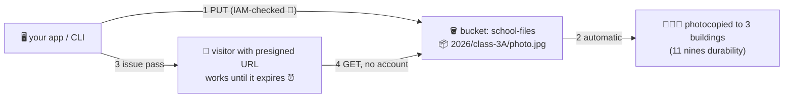

# 🗄️ Lesson 14 — S3: the infinite locker room

**📍 You are here:** Lesson **14** of 20 · Previous: `lesson-13-vpc` · Next: `lesson-15-load-balancers`

---

## 📦 What's in this branch

Lessons 01–14. The most-used AWS service there is — and the first one in
this course that is NOT inside your campus. Real file:

- [s3/presign-lab.sh](../../s3/presign-lab.sh) — the visitor-pass lab, start to finish

## 🧒 Explain like I'm 5

The school needs somewhere to keep *stuff* — photos, homework archives,
backup photocopies, the yearbook. Not in desk drawers (EBS dies with its
desk plans, remember?). The school rents the **infinite locker room**: **S3**.

- A **bucket** 🪣 is one wall of lockers with a name on it. The name is
  unique across every school on Earth (`my-school-yearbooks-2026`).
- An **object** 📦 is a box in a locker: the stuff + a label (**key**)
  like `2026/class-3A/photo.jpg`. Those slashes are *part of the label* —
  there are no real folders, just labels that look tidy.
- **Durability** 🏢🏢🏢: every box is instantly photocopied to **three
  buildings** (AZs). Eleven nines — you will lose your keys before S3
  loses your box.
- **The visitor pass** 🎟️ (**presigned URL**): "this link may open THIS
  box until 3 pm." Anyone holding the pass gets in — no account needed.
  It's how apps let users download private files safely.
- **The default rule** 🛡️: *no strangers, ever* — Block Public Access is
  ON. Half of history's data leaks are schools that turned it off on the
  whole wall when they meant one box.

Cold boxes move to the **basement** (Infrequent Access, cheaper) or the
**salt mine** (Glacier, cheapest, hours to fetch) — lesson 20 reads that bill.

## 🗺️ Diagram



## ❓ What

- **S3 is regional but lives OUTSIDE your VPC** — you call it like a
  website (IAM-signed HTTPS). No disks to size, no desks to patch, pay
  per GB-month + per request.
- **Versioning**: keep every old box when a new one gets the same label —
  deletes just add a marker. Your undo button.
- **Lifecycle rules**: "boxes older than 90 days → basement; 365 → salt
  mine; incomplete uploads → bin." The janitor from the Docker course,
  for objects.
- **Who uses it in this series**: ECR layers live on S3 under the hood;
  Terraform state, k8s etcd backups (k8s lesson 18!), ALB access logs —
  everything meets in the locker room.

## 🤔 Why

EBS (lesson 11) is a *drawer bolted to one desk* — fast, small, one
building. S3 is *the locker room* — infinite, three buildings, reachable
from anywhere with an ID card. Apps that keep files on their own desk
can't scale past one desk; apps that keep files in S3 scale to a fleet
(lesson 12) with zero shared-disk drama.

## 🔧 How

```bash
aws s3 mb s3://school-lab-$RANDOM              # claim a locker wall
echo "hello locker" > note.txt
aws s3 cp note.txt s3://YOUR_BUCKET/notes/note.txt
aws s3 presign s3://YOUR_BUCKET/notes/note.txt --expires-in 300   # 5-min visitor pass
```

## 🧪 Try it (~10 min, ~0¢)

```bash
cd s3 && bash presign-lab.sh        # bucket → upload → pass → prove the pass expires → cleanup
```

## ⏭️ Next

Files sorted. But when the whole town visits the school website at once,
who splits the crowd across your desks? Lesson 15: **the reception desk —
load balancers**.
