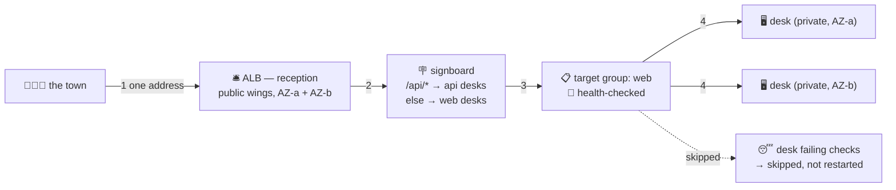

# 🛎️ Lesson 15 — Load balancers: the reception that splits crowds

**📍 You are here:** Lesson **15** of 20 · Previous: `lesson-14-s3` · Next: `lesson-16-route53`

---

## 📦 What's in this branch

Lessons 01–15. The public wing finally gets its resident: the one thing
that SHOULD face the street.

## 🧒 Explain like I'm 5

Sports day: the whole town shows up. You don't let the crowd wander the
corridors knocking on classroom doors — you put a **reception desk** 🛎️
at the gate. That's an **Application Load Balancer (ALB)**.

- The crowd talks to **one address** — the reception. Never to desks.
- Reception keeps a **list of desks that can answer** — the **target
  group** 📋.
- Every few seconds it asks each desk *"ready to answer?"* — the **health
  check** 🙋. No answer → quietly skipped, no restart, no drama. (Feel
  the déjà vu? That's the k8s *readiness probe*, one floor down.)
- The **signboard** 🪧 (**listener rules**) routes by what people ask:
  `/api/*` → the math wing, everything else → the web wing. (And THIS is
  the desk a k8s Ingress actually rides on — the ingress controller just
  writes this signboard for you.)

There's also the **pneumatic tube** — the **NLB**: it doesn't read
requests, just slings network packets at desks at wire speed (L4 vs the
ALB's L7). Databases and game servers take the tube; websites take
reception.

- ALB stands in the **public wings of ≥2 buildings** (finally, lesson 13
  pays off); desks stay private. The only door on the desks' guest list
  (lesson 10): *"from reception's SG only"* — SG-references-SG, the
  pattern from the security-groups lesson, now load-bearing.

## 🗺️ Diagram



## ❓ What

- **Listener**: port + protocol (443 HTTPS — the certificate lives HERE,
  desks can speak plain HTTP behind it).
- **Target group**: desks *or* IPs *or* Lambdas + the health-check recipe
  (path `/health`, healthy after 2 passes, out after 2 fails).
- **ALB vs NLB**: reads HTTP & routes smartly vs raw TCP/UDP at wire
  speed with a fixed IP. Websites/APIs → ALB; databases, MQTT, game
  servers → NLB.
- **The ASG duet** (lesson 12): scale-out → new desks auto-join the
  target group; scale-in → drained politely. Nobody edits a list by hand.

## 🤔 Why

One desk = one point of failure and one building. Reception + desks in
two buildings = a building can burn down mid-sports-day and the town
notices nothing. This lesson is where "multi-AZ" stops being a slogan
and becomes: *ALB in two public wings, desks in two private wings,
health checks deciding who answers*.

## 🔧 How

```bash
# what reception sees (which desks are healthy, and why not):
aws elbv2 describe-target-health --target-group-arn $TG_ARN \
  --query 'TargetHealthDescriptions[].{id:Target.Id,state:TargetHealth.State,why:TargetHealth.Reason}'
```

## 🧪 Try it (~15 min, ~2¢ — the first two-desk lab)

Spin two `t3.micro` desks with lesson 12's user-data (each serves its own
hostname), put an ALB in front, then `watch curl` the ALB address — the
hostname alternates. Stop one desk: traffic flows on, unbroken. Destroy all.

## ⏭️ Next

Reception has a long ugly address (`my-alb-1234.elb.amazonaws.com`). How
does `www.school.com` find it? Lesson 16: **the phonebook — Route 53**.
