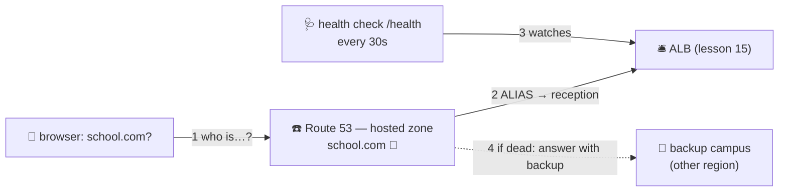

# ☎️ Lesson 16 — Route 53: the school's phonebook (DNS)

**📍 You are here:** Lesson **16** of 20 · Previous: `lesson-15-load-balancers` · Next: `lesson-17-rds`

---

## 📦 What's in this branch

Lessons 01–16. The last hop of the journey: how a NAME becomes your
reception desk.

## 🧒 Explain like I'm 5

Nobody says *"call 172.31.44.12"* — they say *"call the school."* The
thing that turns names into numbers is the **phonebook**: DNS. AWS's
phonebook service is **Route 53** ☎️.

- A **hosted zone** 📖 is your page of the phonebook: everything under
  `school.com`.
- **Records** are the entries:
  - **A** — name → number (IP address), plain and simple.
  - **CNAME** — "see other entry": `www` → `school.com`.
  - **ALIAS** — the AWS trick: name → *the reception desk itself*
    (ALB, S3 site, CloudFront) with no number written down — because
    reception's numbers change! The phonebook just always knows.
- **TTL** ⏰ is "how long may you remember this number before asking
  again." Long TTL = fewer questions but slow changes; short TTL = the
  reverse. (Cutovers: lower TTL a day BEFORE you move.)
- **Health-checked failover** 🚑: the phonebook itself calls reception
  every 30 seconds. Reception dead? The phonebook starts answering with
  the **backup campus's** number. Callers never learn anything was wrong.

And the routing policies are just *how the phonebook answers*:
**weighted** (90/10 coin flip — canary!), **latency** (nearest campus),
**failover** (primary/backup), **geo** (EU callers → EU campus).

## 🗺️ Diagram



## ❓ What

- Route 53 is **global** (not regional — the phonebook is the same
  everywhere) and boringly reliable: its SLA is 100%.
- **ALIAS over CNAME** at the zone root (`school.com` can't legally be a
  CNAME) and for anything AWS-fronted — free queries, auto-updating.
- **Registrar vs DNS**: buying `school.com` and hosting its records are
  separate jobs; Route 53 happens to do both.
- In this series: the k8s course's *external-dns* controller writes these
  records for you — Ingress hostname → Route 53 entry, robots all the
  way down.

## 🤔 Why

Every outage story ends at DNS eventually ("it's always DNS"). Knowing
that a lookup is: browser → recursive resolver → *your hosted zone's
answer, cached for TTL seconds* — lets you reason about cutovers,
canaries, and why the old site still shows for some users an hour after
you "moved" it (their resolver's memory hasn't expired).

## 🔧 How

```bash
# watch the phonebook answer, and see the TTL count down:
dig school.com                      # answer + TTL
dig school.com @1.1.1.1             # ask a specific resolver
aws route53 list-hosted-zones --query 'HostedZones[].{name:Name,id:Id}'
```

## 🧪 Try it (~10 min, free with `dig`)

No domain needed: `dig` any site twice and watch the TTL drop between
answers — you're reading someone's phonebook cache in real time. Then
`dig +trace school.com` to walk the full chain root → TLD → zone.

## ✅ Verify — what you should see

`dig school.com` twice a minute apart: the TTL counts down; `dig +trace` walks root → TLD → your zone.

## 🧹 Clean up — do not leave running

nothing to clean up — this lesson is free 🎉

## ⚠️ Common mistakes

- a CNAME at the zone apex (illegal) — use ALIAS
- cutting over with a 24-hour TTL still cached everywhere
- registering the domain and forgetting the hosted zone is a separate thing

## ⏭️ Next

Crowd handled, name resolved. But the school's *records* — grades,
enrollments — need a real database, and running one yourself on a desk
is a part-time job. Lesson 17: **RDS, the record office you rent**.
