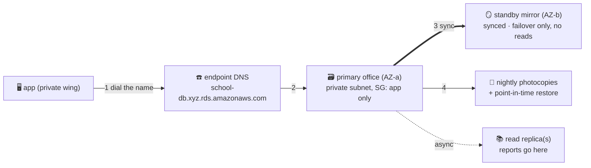

# 🗃️ Lesson 17 — RDS: the record office you rent

**📍 You are here:** Lesson **17** of 20 · Previous: `lesson-16-route53` · Next: `lesson-18-cloudwatch`

---

## 📦 What's in this branch

Lessons 01–17. The stateful heart of every real system — and the first
service where "managed" earns its price tag.

## 🧒 Explain like I'm 5

The school's records — grades, enrollments, fees — live in the **record
office** 🗃️: the database. You have two choices:

1. **Run it yourself** on a desk (Postgres on EC2): YOU become the clerk.
   Nightly photocopies, software patches, a spare office when this one
   floods, 3 AM recoveries — all you, forever.
2. **Rent the office WITH a clerk included** — **RDS**. You pick the
   engine (Postgres, MySQL…) and the office size; AWS does backups,
   patching, and the failover drill.

The three renter's perks:

- **Nightly photocopies** 📸 — automated backups + point-in-time restore:
  *"the office as it was Tuesday, 14:03."*
- **The mirror office** 🪞 — **Multi-AZ**: an exact standby in the *next
  building*, synced every second. Primary floods → AWS flips the
  phonebook entry to the mirror in ~a minute. Your app just… reconnects.
  The mirror is for *surviving*, not for reading — it serves no traffic
  until the failover.
- **Photocopy desks for readers** 📚 — **read replicas**: heavy report
  season? Add read-only copies; writers keep the real office. These are
  *separate* copies built for read scaling — not the Multi-AZ standby.

And one detail that ties the whole course: your app never learns the
office's number — it dials the **endpoint** (a DNS name, lesson 16's
phonebook!) which always points at the current primary. The reception-desk
trick, applied to state.

## 🗺️ Diagram



## ❓ What

- **Multi-AZ ≠ read replica**: the mirror is for *surviving* (sync,
  invisible, auto-failover); replicas are for *reading* (async, visible,
  no failover promise). Exam favorite, outage favorite.
- **Placement**: private subnets (lesson 13), SG allowing *only the app
  desks' SG* (lesson 10's pattern, again).
- **vs k8s StatefulSets** (k8s lesson 22): you CAN run Postgres in the
  cluster with name-plate desks — you're just the clerk again, with
  extra steps. Most teams: stateless in k8s, state in RDS. Buy the
  boring, build the special.
- **Aurora**: AWS's own engine — same doorway, fancier building (storage
  photocopied 6× across 3 buildings, faster failover, pricier).

## 🤔 Why

State is where cloud mistakes stop being funny. A lost stateless desk =
a shrug (lesson 12 replaces it). A lost record office = the school has
no grades. That asymmetry is the whole argument for paying the clerk:
the parts that are *someone's full-time craft* — backups that restore,
failovers that fail over — come rented, tested, and boring.

## 🔧 How

```bash
aws rds describe-db-instances --query \
  'DBInstances[].{id:DBInstanceIdentifier,engine:Engine,size:DBInstanceClass,multiAZ:MultiAZ,endpoint:Endpoint.Address}'
# the failover drill (Multi-AZ instances):
aws rds reboot-db-instance --db-instance-identifier school-db --force-failover
```

## 🧪 Try it (~20 min, ~free on db.t4g.micro free tier — DESTROY after)

Create a `db.t4g.micro` Postgres in your lab VPC's private subnets,
`psql` to the **endpoint name** from a desk, insert a row, reboot with
`--force-failover`, watch the same name answer from the other building.
Then delete it (skip the final snapshot in a lab, and check it's gone —
lesson 20 explains why).

## ⏭️ Next

Desks, files, crowds, names, records — running. But who's *watching* it
all at 3 AM? Lesson 18: **CloudWatch — report cards, diaries, and alarm
bells**.
