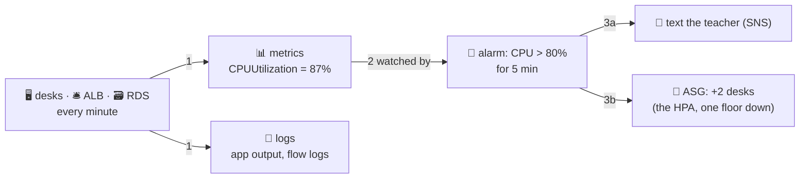

# 📈 Lesson 18 — CloudWatch: report cards, diaries, alarm bells

**📍 You are here:** Lesson **18** of 20 · Previous: `lesson-17-rds` · Next: `lesson-19-lambda`

---

## 📦 What's in this branch

Lessons 01–18. Everything you've built so far, finally *visible*.

## 🧒 Explain like I'm 5

A school you can't see is a school you find out about from angry parents.
**CloudWatch** is the school's whole awareness system, in three parts:

- **Report cards** 📊 (**metrics**): every desk, reception, and record
  office mails in numbers every minute — CPU, requests, healthy-desk
  count, free storage. A metric is just a number with a timestamp,
  filed by name.
- **Diaries** 📔 (**logs**): the actual text of what happened —
  application output, Lambda prints, VPC flow logs (who knocked on which
  wing — lesson 13's corridors, written down).
- **Alarm bells** 🔔 (**alarms**): a rule watching one number: *"if CPU
  > 80% for 5 minutes → ring."* And ringing DOES something: texts the
  teacher (SNS), or — the beautiful one — tells the fleet manager to
  **add desks** (the ASG from lesson 12; this alarm IS the k8s HPA's
  rainy-day buses, one layer down).

One famous surprise 🫢: EC2's built-in report card has **no memory
column**. The hypervisor can see CPU from outside, but memory is the
desk's private business — you must install the **CloudWatch agent**
(a little reporter ON the desk) to mail that in.

## 🗺️ Diagram



## ❓ What

- **Namespaces & dimensions**: metrics file under `AWS/EC2`,
  `AWS/ApplicationELB`… sliced by instance/target-group. Your app can
  mail custom ones (`put-metric-data`) — orders per minute is a metric too.
- **Alarm states**: `OK` / `ALARM` / `INSUFFICIENT_DATA` — the third one
  usually means the desk stopped reporting, which is its own emergency.
- **Logs Insights**: grep for diaries — query terabytes of log lines
  (`filter @message like /ERROR/ | stats count() by bin(5m)`).
- **Dashboards**: the noticeboard by the staff room — the four graphs
  everyone glances at.
- In this series: k8s lesson 26's Prometheus/Grafana is this exact
  trio, self-hosted; EKS control-plane logs land here.

## 🤔 Why

Lesson 20 will tell you what the school *costs*; this lesson tells you
what it's *doing* — and the alarm-→-action wiring is the difference
between "monitoring" (pretty graphs you look at after the outage) and
"operating" (the school reacts before you wake up). Metrics say THAT
something's wrong, diaries say WHY: you need both, filed and findable.

## 🔧 How

```bash
# read a desk's report card from the CLI (last hour of CPU):
aws cloudwatch get-metric-statistics --namespace AWS/EC2 \
  --metric-name CPUUtilization --dimensions Name=InstanceId,Value=$ID \
  --start-time $(date -u -v-1H +%FT%TZ) --end-time $(date -u +%FT%TZ) \
  --period 300 --statistics Average
```

## 🧪 Try it (~15 min, pennies)

Boot lesson 07's desk, `stress --cpu 2` it (user-data installs stress),
create an alarm at CPU > 50% wired to an SNS topic your email subscribes
to, and wait for the mail. Read the same spike as a graph. Destroy —
and notice the alarm itself is free to keep, but the desk isn't.

## ✅ Verify — what you should see

the alarm goes `OK → ALARM` during the stress test and the SNS email arrives; the metric graph shows the spike.

## 🧹 Clean up — do not leave running

`terraform destroy` the desk; the alarm itself is free to keep

## ⚠️ Common mistakes

- alarming on averages over 1 hour — the spike averages away
- expecting a memory metric without the CloudWatch agent
- `INSUFFICIENT_DATA` ignored — the desk stopped reporting, that's an incident

## ⏭️ Next

Everything so far assumed a desk waiting for work. But some work is one
errand a day — renting a desk for that is silly. Lesson 19: **Lambda,
the helper who exists only while called**.
