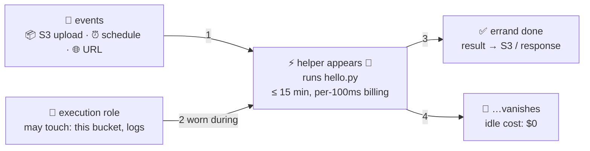

# ⚡ Lesson 19 — Lambda: the helper who exists only while called (serverless functions)

**📍 You are here:** Lesson **19** of 20 · Previous: `lesson-18-cloudwatch` · Next: `lesson-20-the-bill`

---

## 📦 What's in this branch

Lessons 01–19. The other way to run code — no desk at all. Real file:

- [lambda/hello.py](../../lambda/hello.py) — the entire "server"

## 🧒 Explain like I'm 5

Renting a desk (EC2) means paying for the desk **while it sits empty**.
But some jobs are *errands*: resize a photo when one is uploaded, run a
report at midnight. For errands, the school has a magical **on-call
helper** ⚡: **Lambda**.

- An **event** happens 🔔 — a box lands in the locker room (S3 upload),
  the morning bell rings (schedule), someone calls a URL.
- The helper **pops into existence** 💨, does exactly that one errand
  (15 minutes maximum), and **vanishes**.
- You pay **per errand, per 100 ms** — an idle helper costs *zero*.
  A thousand boxes land at once? A thousand helpers appear. Scaling
  isn't a feature you configure; it's just what "one helper per errand"
  means.

Two honest footnotes:

- **Cold starts** 🥶: a helper who hasn't been called in a while spends
  ~100 ms–2 s "putting their shoes on" before working. Usually fine;
  matters for latency-critical APIs.
- **The helper carries an IAM hat** 🎩 (lesson 04, of course): its
  *execution role* is exactly what the errand may touch — this S3
  bucket, that log diary, nothing else.

## 🗺️ Diagram



## ❓ What

- **Function** = your code + runtime (Python/Node/…) + memory size
  (CPU scales WITH memory — the one dial) + timeout + execution role.
- **Triggers everywhere**: S3, SQS queues, EventBridge schedules
  (CronJobs without a cluster — k8s lesson 18's bell, serverless),
  ALB target groups (lesson 15 — reception can route to helpers!),
  function URLs for quick HTTP.
- **When NOT**: steady heavy traffic (a rented desk is cheaper than
  helpers-per-request at constant load), jobs > 15 min, special
  hardware, or heavy long-lived connections. The scooter/truck lesson
  (08) applies to *paradigms* too.
- **Logs**: every `print` lands in CloudWatch diaries (lesson 18)
  automatically — your only window into a vanished helper.

## 🤔 Why

This is the third answer to "where does code run": rent desks (EC2),
run a school of desks (k8s), or **describe errands** (Lambda). Whole
glue-layers of real systems — thumbnails, webhooks, nightly cleanups,
the ops scripts from lesson 12 — are cheapest and simplest as errands.
Knowing all three paradigms (and their bills) is what "architect" means.

## 🔧 How

```bash
zip fn.zip hello.py
aws lambda create-function --function-name hello --runtime python3.12 \
  --handler hello.handler --zip-file fileb://fn.zip --role $HELPER_ROLE_ARN
aws lambda invoke --function-name hello --payload '{"name":"class 3A"}' out.json
cat out.json     # {"greeting": "hello, class 3A"}
```

## 🧪 Try it (~10 min, free — a million errands/month are $0)

Run the four commands above (the trust policy for the role is lesson
04's, verbatim — who may wear the hat: `lambda.amazonaws.com`). Invoke it
five times fast; read the REPORT lines in the CloudWatch diary — spot
the one cold start vs four warm ones, in milliseconds.

```bash
aws lambda delete-function --function-name hello   # tidy, as always
```

## ✅ Verify — what you should see

`aws lambda invoke` writes `{"greeting": "hello, class 3A"}`; the CloudWatch log group shows one cold `Init Duration` and four warm invocations.

## 🧹 Clean up — do not leave running

`aws lambda delete-function --function-name hello` — a million invocations are free, but tidy anyway

## ⚠️ Common mistakes

- a 15-minute job in a 15-minute-capped helper
- giving the execution role `*` — hats are least-privilege too
- expecting state between invocations — helpers forget

## ⏭️ Next

You now rent desks, lockers, receptions, offices, and helpers. One
skill left, and it's the one that keeps this hobby affordable: **reading
the meter**. Lesson 20 — **the bill**.
