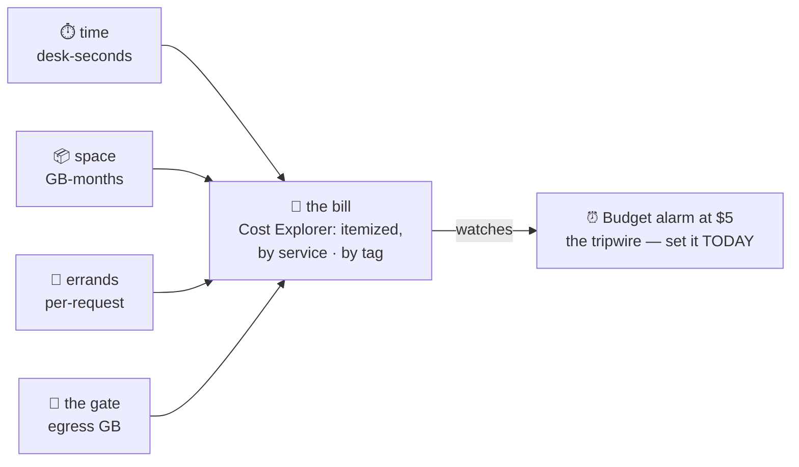

# 🧾 Lesson 20 — The bill: reading the meter

**📍 You are here:** Lesson **20** of 25 — Part 3 ends here · Previous: `lesson-19-lambda` · Next: `lesson-21-subnet-networking`

---

## 📦 What's in this branch

All 20 lessons — the complete course. The graduation skill: nobody fears
the cloud who can read its meter.

## 🧒 Explain like I'm 5

The school doesn't send one bill — it reads **four meters** 🧾:

1. **Time** ⏱️ — desks by the second, offices by the hour, helpers by
   the 100 ms. *Running = paying.*
2. **Space** 📦 — GB-months: drawers (EBS), lockers (S3), photocopies
   (snapshots). *Existing = paying* — even when the desk is off.
3. **Errands** 🔁 — per-request: S3 GETs, Lambda invokes, phonebook
   lookups. Tiny numbers × huge counts.
4. **The gate** 🚪 — **egress**: data LEAVING the campus costs money;
   entering is free. The meter nobody notices until it's the biggest line.

And the four classic surprises, in the order everyone meets them:

- 😱 **The stopped desk's drawer**: `stop` returns the desk (no ⏱️) but
  keeps the drawer (📦 forever). `terminate` returns both. Lesson 11's
  what-survives-what table was secretly a bill.
- 😱 **The NAT postbox** (lesson 13): ~$32/month + per-GB *for existing*.
  The #1 "why is my empty account $40?" answer.
- 😱 **Orphan photocopies**: snapshots and AMIs outlive their desks.
- 😱 **The idle reception/office**: ALB and RDS bill hourly whether
  anyone visits or not. Labs that skip `destroy` become subscriptions.

## 🗺️ Diagram



## ❓ What

- **Cost Explorer** — the itemized bill: slice by service, by day, by
  **tag** (name labels on desks — `project: school-lab` — so the bill
  says *whose*). Turn it on day one; it only records forward.
- **AWS Budgets** — the tripwire: "email me at 80% of $5." Free, takes
  three minutes, has saved more students than any other feature.
- **Free tier**: 12-month kind (750 t-shirt-size desk hours/month),
  always-free kind (1M Lambda errands, 25 GB DynamoDB), and trial kind.
  Know which kind your labs use — the 12-month clock does run out.
- **The estimate habit**: before any lab, name the meters it will spin.
  This course: desks ⏱️ pennies, VPC free, S3 pennies, ALB/RDS hourly
  (the two to never forget), Lambda free, NAT avoided on purpose.

## 🤔 Why

Cost is architecture's fourth dimension: multi-AZ photocopying (lesson
15, 17) buys survival with egress and hours; S3 classes trade retrieval
speed for GB-price; Lambda trades cold starts for zero idle. Engineers
who read meters design better schools — and keep their hobby accounts.

## 🔧 How

```bash
# the tripwire (do this once, today):
aws budgets create-budget --account-id $ACCT --budget \
  '{"BudgetName":"tripwire","BudgetLimit":{"Amount":"5","Unit":"USD"},"TimeUnit":"MONTHLY","BudgetType":"COST"}' \
  --notifications-with-subscribers file://notify-me.json
# the audit walk (find the four surprises in YOUR account):
aws ec2 describe-volumes --filters Name=status,Values=available   # orphan drawers
aws ec2 describe-snapshots --owner-ids self --query 'length(Snapshots)'
aws ec2 describe-nat-gateways --filter Name=state,Values=available
```

## 🧪 Try it (~10 min, saves money instead of costing it)

Set the $5 budget tripwire. Run the audit walk above. Delete what it
finds. Tomorrow, open Cost Explorer and read this course's total —
you'll find the whole 20 lessons cost less than one coffee. ☕

## ✅ Verify — what you should see

AWS Budgets shows the $5 budget; Cost Explorer (tomorrow) lists this course's total under a coffee.

## 🧹 Clean up — do not leave running

run the audit walk: no `available` volumes, no stray snapshots, no NAT gateways, no ALBs, no DB instances

## ⚠️ Common mistakes

- a stopped instance's EBS drawer billing for months
- 'free tier' assumed after the 12 months ran out
- never opening Cost Explorer until the email

## 🎓 You made it

Identity, desks, campus, lockers, reception, phonebook, record office,
report cards, helpers, and the meter. Now walk one course up:
[Docker](https://baluraut.github.io/learn-docker-school/) packs the
lunchboxes, [Kubernetes](https://baluraut.github.io/learn-kubernetes-school/)
runs them on THESE desks inside THIS campus, and
[ArgoCD](https://baluraut.github.io/learn-argocd-school/) deploys them
from git. It's schools all the way up. 🏫
