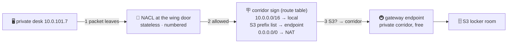

# 🪧 Lesson 21 — Subnet networking: corridor signs, hallway rules, private corridors

**📍 You are here:** Lesson **21** of 25 — Part 4 begins! · Previous: `lesson-20-the-bill` · Next: `lesson-22-nat-gateway`

---

## 📦 What's in this branch

Lessons 01–21. Lesson 13 drew the campus; this lesson walks its corridors
with a torch. Real file:

- [vpc/endpoints.tf](../../vpc/endpoints.tf) — a private corridor to the locker room (S3), free

## 🧒 Explain like I'm 5

Three things decide where a packet can walk on the campus:

1. **Corridor signs** 🪧 (**route tables**). Every wing has exactly one
   sign, and every sign starts with the same first line: *"10.0.0.0/16 →
   local"* (anywhere on campus, just walk). What comes after decides the
   wing's personality: *"0.0.0.0/0 → gate"* = public wing; *"0.0.0.0/0 →
   postbox"* = private wing that can mail out; no second line = a sealed
   wing that only talks to the campus.
2. **Hallway rules** 🚦 (**NACLs — network ACLs**). A rule board at the
   wing's door: numbered lines, checked top to bottom, *allow* or *deny*,
   and **stateless** — they don't remember conversations. Let a request
   in on port 443 and you must ALSO let the reply out on the "ephemeral"
   ports (1024–65535), or the answer is stopped at the door. The default
   board says allow-everything, and 95% of campuses leave it that way.
   Compare the **guest list** at the desk (security groups, lesson 10):
   stateful, allow-only, per desk. SGs first, always; NACLs for blunt
   blocks like "this IP range never enters the wing."
3. **Private corridors** 🚇 (**VPC endpoints**). The locker room (S3) is
   *outside* the campus — so a private desk normally needs the postbox
   (NAT, $$) just to fetch a file. A **gateway endpoint** adds a line to
   the corridor sign: *"S3's addresses → the private corridor"* — no
   gate, no postbox, no charge. **Interface endpoints (PrivateLink)** are
   private phone lines to other services (Secrets Manager, ECR, SSM…):
   a network card in your wing with a private IP, hourly cost.

And when two campuses must talk: **peering** (a footbridge between two
VPCs, no transit) or a **Transit Gateway** (the central skywalk hub for
many campuses). Both are just more lines on the corridor signs.

## 🗺️ Diagram



## ❓ What

- **One route table per subnet** (a table may serve many subnets). Most
  specific prefix wins; `local` can't be removed.
- **NACL vs SG**: subnet vs instance · stateless vs stateful · allow+deny
  vs allow-only · numbered rules vs a set. Default NACL = allow all;
  default SG = deny all inbound.
- **Gateway endpoints**: S3 and DynamoDB only, free, route-table based.
  **Interface endpoints**: ~everything else, ENI in your subnet, private
  DNS, hourly + per-GB. ECR pulls from private EKS nodes commonly ride
  three interface endpoints (ecr.api, ecr.dkr, s3 gateway).
- **Peering** is non-transitive (A↔B and B↔C ≠ A↔C); **Transit Gateway**
  is the hub that fixes that at scale.

## 🤔 Why

"Can't reach it" tickets are 90% corridor signs and hallway rules, and
"why is NAT $200 this month" is 90% traffic that should have taken a
private corridor. This lesson turns both from mysteries into a
three-line checklist: sign → NACL → SG.

## 🔧 How

```bash
# read a subnet's corridor sign and hallway rules:
aws ec2 describe-route-tables --filters Name=association.subnet-id,Values=$SUBNET \
  --query 'RouteTables[].Routes[].{dst:DestinationCidrBlock,via:GatewayId||NatGatewayId||VpcEndpointId}'
aws ec2 describe-network-acls --filters Name=association.subnet-id,Values=$SUBNET \
  --query 'NetworkAcls[].Entries[].{n:RuleNumber,act:RuleAction,egress:Egress,cidr:CidrBlock}'
```

## 🧪 Try it (~10 min, free)

```bash
cd vpc && terraform apply          # lesson 13's campus + endpoints.tf
# the private wing's sign now has an S3 line pointing at the endpoint — read it:
aws ec2 describe-route-tables --filters Name=vpc-id,Values=$(terraform output -raw vpc_id) \
  --query 'RouteTables[].Routes[?VpcEndpointId!=null]'
terraform destroy
```

## ✅ Verify — what you should see

the private route table shows a route for the S3 **prefix list** pointing at `vpce-…`; `aws s3 ls` from a private desk works with NAT disabled.

## 🧹 Clean up — do not leave running

nothing to clean up — this lesson is free 🎉

## ⚠️ Common mistakes

- NACL allows 443 in but not the ephemeral ports out — stateless bites
- peering A↔B, B↔C and expecting A↔C — not transitive
- paying NAT for S3 traffic an endpoint would carry free

## ⏭️ Next

The sign said *"0.0.0.0/0 → postbox"* for everything that isn't S3. Time
to look inside the postbox — and its bill. Lesson 22: **the NAT gateway**.
