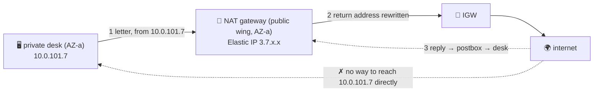

# 📮 Lesson 22 — The NAT gateway: the one-way postbox, in depth

**📍 You are here:** Lesson **22** of 25 · Previous: `lesson-21-subnet-networking` · Next: `lesson-23-route53-routing`

---

## 📦 What's in this branch

Lessons 01–22. The most-billed box on the campus map gets its own lesson.
Real file:

- [vpc/nat.tf](../../vpc/nat.tf) — a postbox per building, with the cost warning written in

## 🧒 Explain like I'm 5

Private-wing desks have no street windows (lesson 13) — but they still
need to *send* letters: fetch updates, call an API, pull an image. The
**NAT gateway** 📮 is the postbox bolted to the public wing's wall:

- A desk drops a letter in; the postbox **rewrites the return address**
  to its own public one (the **Elastic IP** 🏷️), walks it out the gate,
  and hands the reply back to the right desk. Outside the campus, only
  the postbox's address is ever seen — strangers can't mail a private
  desk because they don't know its number, and the sign gives them no
  way in. *Out yes, in no.* That's the whole security story.
- It's **managed**: AWS keeps it running and scales it to ~100 Gbps.
- It lives in **one building** (AZ). If building A burns, the postbox in
  A goes with it — and desks in building B that were told *"mail via the
  postbox in A"* are suddenly mute. Real campuses put **one postbox per
  building** and point each private wing at its *own* building's postbox
  (that's what nat.tf does).

Now the bill 🧾 (lesson 20's classic): a postbox costs **~$32/month for
existing** plus **~4¢ per GB** that passes through — *both ways*. Two
common mistakes: (1) desks in B mailing through A's postbox pay cross-AZ
data charges on top; (2) sending gigabytes of S3/ECR traffic through the
postbox when a **private corridor** (lesson 21's endpoint) would carry it
for free.

Relatives: the old **NAT instance** (a desk you ran yourself as a postbox
— cheaper, but you patch it and it doesn't scale), and the **egress-only
internet gateway** for IPv6 (same "out yes, in no", no NAT needed since
IPv6 addresses are already public).

## 🗺️ Diagram



## ❓ What

- **Needs**: a public subnet, an Elastic IP, and a route `0.0.0.0/0 →
  nat-xxxx` in each private subnet's table.
- **HA pattern**: one NAT per AZ; each private subnet routes to its own
  AZ's NAT. One shared NAT = cheaper, single point of failure, cross-AZ
  charges.
- **Cost levers**: gateway endpoints for S3/DynamoDB (free), interface
  endpoints for chatty AWS APIs, keep large downloads (AMIs, images) in
  your own region, put internet-facing work behind the ALB instead.
- **Pricing (us-east-1, rough)**: $0.045/hour + $0.045/GB processed.

## 🤔 Why

Nearly every "surprise" AWS bill in a small account is a NAT gateway
someone forgot, or NAT traffic that should have been an endpoint. Knowing
exactly what the postbox does — and doesn't — lets you design the campus
so the postbox is small, per-building, and carries only what must leave.

## 🔧 How

```bash
aws ec2 describe-nat-gateways --filter Name=state,Values=available \
  --query 'NatGateways[].{id:NatGatewayId,az:SubnetId,eip:NatGatewayAddresses[0].PublicIp}'
# what's flowing through it (last hour, GB out):
aws cloudwatch get-metric-statistics --namespace AWS/NATGateway --metric-name BytesOutToDestination \
  --dimensions Name=NatGatewayId,Value=$NAT --start-time $(date -u -v-1H +%FT%TZ) \
  --end-time $(date -u +%FT%TZ) --period 3600 --statistics Sum
```

## 🧪 Try it (~15 min, ~10¢ — the first lab that bills by the hour, so DESTROY)

```bash
cd vpc && terraform apply -var enable_nat=true      # adds a postbox in AZ-a + the private route
# from a private desk (SSM, lesson 09): curl -s ifconfig.me  → prints the postbox's Elastic IP
terraform destroy                                    # ⏰ before you do anything else
```

## ⏭️ Next

The campus can mail out. Now let's make the *phonebook* smarter than
"one name → one number." Lesson 23: **Route 53 routing policies and
private zones**.
