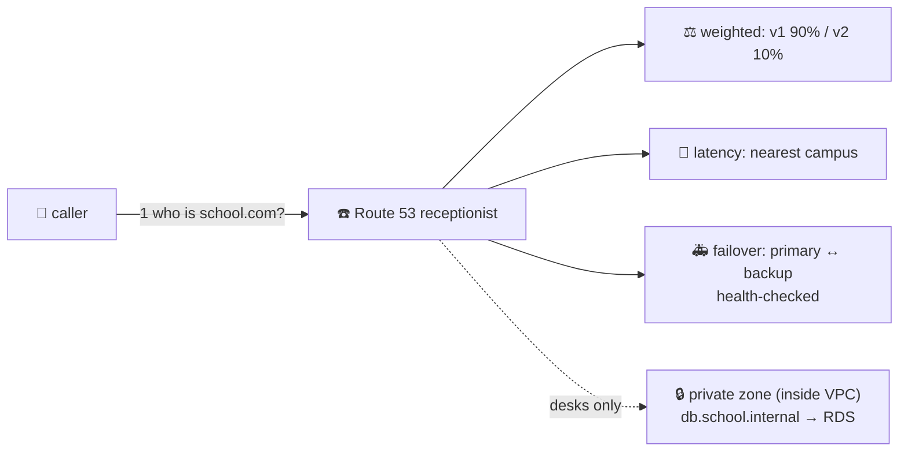

# ☎️ Lesson 23 — Route 53 routing policies & private zones: the clever phonebook

**📍 You are here:** Lesson **23** of 25 · Previous: `lesson-22-nat-gateway` · Next: `lesson-24-waf-shield`

---

## 📦 What's in this branch

Lessons 01–23. Lesson 16 taught the phonebook; this one teaches the
phonebook's *tricks* — how it answers differently to different callers.

## 🧒 Explain like I'm 5

A plain phonebook has one number per name. Route 53's phonebook has a
**receptionist** who looks at *who's calling* and *what's healthy* before
answering. Her seven moods (**routing policies**):

- **Simple** — one name, one answer. The lesson-16 default.
- **Weighted** ⚖️ — "90% of callers get campus v1, 10% get v2." The
  **canary**: ship the new reception to a tenth of the town, watch the
  report cards (lesson 18), turn the dial.
- **Latency** 🏃 — "answer with whichever campus is *fastest* for this
  caller" (Mumbai callers → Mumbai, Frankfurt callers → Frankfurt).
- **Failover** 🚑 — primary/secondary with a health check (lesson 16's
  bell): primary sick → answer with the backup, automatically.
- **Geolocation** 🗺️ — by where the caller lives (EU → EU campus, for
  data-residency rules). **Geoproximity** adds a "bias" dial.
- **Multivalue** 🎲 — hand out up to 8 healthy numbers and let the caller
  pick; poor-man's load balancing.

And the phonebook nobody outside can read: the **private hosted zone** 🔒.
Inside the campus, desks want to say `db.school.internal`, not an RDS
endpoint that changes when you rebuild the office. A private zone is a
phonebook page attached to your VPC(s): resolvable inside, invisible
outside. Every "how do the desks find the record office / the cache /
each other by name?" question ends here.

## 🗺️ Diagram



## ❓ What

- **Health checks** feed failover *and* multivalue *and* weighted (an
  unhealthy weighted record is skipped). Checks cost a little per month.
- **ALIAS** records (lesson 16) work with every policy and can target
  ALB, CloudFront, API Gateway (lesson 25), S3 websites — and other
  records in the same zone.
- **TTL discipline**: a weighted canary with a 24-hour TTL is not a
  canary; use 60 s while experimenting.
- **Private zones**: associate with one or more VPCs; `*.internal` names
  are convention, not requirement. Split-horizon = same name public and
  private, different answers.
- **Resolver**: the campus's built-in phone operator at VPC+2 (e.g.
  10.0.0.2); hybrid setups add inbound/outbound resolver endpoints.

## 🤔 Why

Blue/green deploys, multi-region survival, EU-only data, canary
releases, and service discovery inside the VPC are all *DNS decisions*.
The team that understands the receptionist's moods ships those with a
record change; everyone else builds proxies.

## 🔧 How

```bash
# a weighted canary: two records, same name, weights 90 / 10
aws route53 change-resource-record-sets --hosted-zone-id $ZONE --change-batch file://canary.json
# a private zone for the campus
aws route53 create-hosted-zone --name school.internal --caller-reference $(date +%s) \
  --vpc VPCRegion=us-east-1,VPCId=$VPC --hosted-zone-config PrivateZone=true
```

## 🧪 Try it (~15 min, ~free — a private zone costs ~$0.50/month, destroy after)

Create `school.internal` attached to lesson 13's VPC, add an A record
`db.school.internal → 10.0.101.50`, then from a desk inside:
`dig db.school.internal` answers; from your laptop it doesn't exist.
That asymmetry *is* the lesson. Delete the zone.

## ⏭️ Next

Callers can now find the right campus, fast. Some of them are not
friends. Lesson 24: **WAF & Shield — the bouncer at the gate**.
