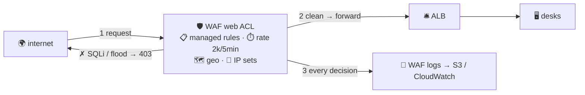

# 🛡️ Lesson 24 — WAF & Shield: the bouncer at the gate

**📍 You are here:** Lesson **24** of 25 · Previous: `lesson-23-route53-routing` · Next: `lesson-25-api-gateway`

---

## 📦 What's in this branch

Lessons 01–24. Reception (lesson 15) lets everyone in who knocks. Time to
hire someone who reads the *letter* before it reaches reception. Real file:

- [waf/waf.tf](../../waf/waf.tf) — a web ACL with managed rules + a rate limit, attached to the ALB

## 🧒 Explain like I'm 5

Security groups (lesson 10) check *where* a visitor comes from and *which
door* they knock on — they never read what the visitor is carrying. The
**Web Application Firewall (WAF)** 🛡️ is the **bouncer** standing in
front of reception who opens every envelope:

- **Managed rule groups** 📋 — AWS (and vendors) publish rule books: the
  *Common Rule Set* (the classic web attacks: injection, bad headers,
  oversized bodies), *Known Bad Inputs*, *SQL database*, *bot control*.
  You attach a book; it updates itself.
- **Rate-based rules** ⏱️ — "any single IP over 2,000 requests in 5
  minutes gets blocked for a while." The one rule that stops the kid who
  refreshes 500 times a second.
- **Your own rules** ✍️ — IP sets (allow the office, block a range),
  geo-match (no traffic from countries you don't serve), string/regex
  matches on paths or headers.
- **Count mode first** 🧪 — every rule can *count* instead of *block*.
  You always start in count, read the logs for a day, and only then flip
  to block. Bouncers who block on day one throw out the principal.

Attach the bouncer to the **ALB**, **API Gateway** (lesson 25), or
**CloudFront** — the three places visitors arrive. And under it all,
**Shield Standard** (free, automatic) absorbs the big shoving crowds
(network-layer DDoS); **Shield Advanced** (paid) adds a response team
and cost protection for the days the whole town shows up angry.

## 🗺️ Diagram



## ❓ What

- **Web ACL** = ordered rules + a default action; attached to one or more
  resources. Rules cost per ACL, per rule, per million requests.
- **Scope**: `REGIONAL` for ALB/API Gateway, `CLOUDFRONT` for the edge.
- **Rate limit granularity**: per IP by default; newer options key on
  headers/paths (per-user, per-endpoint).
- **Logging**: enable it; it is how you tune false positives (a legit
  form post that the SQLi rule dislikes).
- **Where WAF can't help**: auth bugs, business-logic abuse, anything
  inside TLS to a non-fronted service. Defense in depth: SG (door) +
  WAF (envelope) + app validation (contents).

## 🤔 Why

The internet is 40% bots on a good day. Without a bouncer, reception
spends its day answering probes for `/wp-admin` and your logs are noise.
WAF is cheap, managed, and turns "we got hammered last night" into a
graph you glance at. The count-then-block habit is the real skill.

## 🔧 How

```bash
# what the bouncer has been doing (top blocked rules, last hour):
aws wafv2 get-sampled-requests --web-acl-arn $ACL --rule-metric-name RateLimit \
  --scope REGIONAL --time-window StartTime=$(date -u -v-1H +%s),EndTime=$(date -u +%s) --max-items 20
```

## 🧪 Try it (~15 min, ~5¢ — attaches to lesson 15's ALB, destroy both)

```bash
cd waf && terraform apply -var alb_arn=$ALB_ARN   # common rules (count) + rate limit (block)
for i in $(seq 1 3000); do curl -s -o /dev/null $ALB_URL/ & done; wait   # the refresh kid
curl -i $ALB_URL/                                  # → 403 from the bouncer, for a while
terraform destroy
```

## ✅ Verify — what you should see

`curl -i ALB_URL` returns 200; after the flood loop it returns **403** for a while; the WAF sampled requests show the rate rule firing.

## 🧹 Clean up — do not leave running

`terraform destroy` here AND lesson 15's ALB — both bill hourly

## ⚠️ Common mistakes

- managed rules in block mode on day one — a legit form post gets 403
- forgetting WAF only sees what reaches the ALB/API Gateway/CloudFront
- no logging enabled, so no way to tune false positives

## ⏭️ Next

Websites have reception. APIs deserve their own front desk — one that
counts tickets, checks IDs, and hands errands straight to Lambda.
Lesson 25: **API Gateway**.
