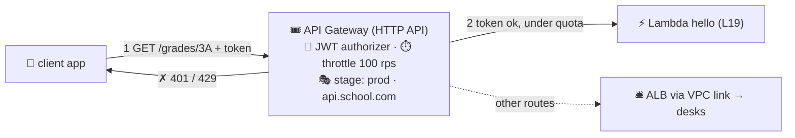

# 🎟️ Lesson 25 — API Gateway: the front desk for APIs

**📍 You are here:** Lesson **25** of 25 — the final lesson! 🎓 · Previous: `lesson-24-waf-shield`

---

## 📦 What's in this branch

All 25 lessons — the complete course. The last box on the map is the one
your apps will talk to most. Real file:

- [apigw/api.tf](../../apigw/api.tf) — an HTTP API in front of lesson 19's hello helper

## 🧒 Explain like I'm 5

Reception (the ALB) is built for *crowds of browsers*. **API Gateway** 🎟️
is a different front desk, built for *programs* calling *programs*:

- **Routes** 🪧 — `GET /grades/{id}` → this helper; `POST /homework` →
  that one. Each route can point at a **Lambda** (lesson 19 — no desks at
  all), at desks behind the ALB via a **VPC link**, or at any HTTP URL.
- **The ID check** 🪪 — before forwarding, the desk can verify a **JWT**
  (from Cognito or any OIDC issuer), require **IAM** signatures, or ask
  a small **Lambda authorizer** to decide. Your helpers never see an
  unauthenticated request.
- **Tickets** ⏱️ — **throttling** (requests per second, burst) protects
  the helpers from stampedes; **usage plans + API keys** give partner A
  1,000 calls/day and partner B 10,000 — metered, per key.
- **Stages** 🎭 — `dev`, `prod`: same routes, different settings and
  addresses; a **custom domain** (`api.school.com`, via lesson 23's
  phonebook + a certificate) hides the ugly default URL.
- Extras the ALB doesn't do: **CORS** in one setting, request/response
  transformation, caching, per-route logging and metrics, WebSocket APIs
  for push.

Two flavors: **HTTP API** (newer, cheaper, faster — the default for
Lambda/REST-ish work) and **REST API** (older, more knobs: caching,
request validation, usage plans). When to use the **ALB** instead: steady
high traffic to desks (hourly beats per-request), non-HTTP protocols, or
when you need none of the above.

## 🗺️ Diagram



## ❓ What

- **Pricing**: HTTP API ≈ $1 per million requests; REST API ≈ $3.50;
  plus data out. No hourly charge — idle = $0 (the Lambda lesson's
  economics, extended to the front desk).
- **Integrations**: Lambda proxy (event in, JSON out), HTTP proxy,
  private (VPC link → ALB/NLB), AWS service (write straight to SQS).
- **Auth options**: JWT (HTTP API), IAM SigV4, Lambda authorizer, Cognito
  user pools (REST), API keys (identification, *not* authentication).
- **Limits to know**: 29 s integration timeout (long jobs → async +
  polling or WebSockets), 10 MB payload.
- **Observability**: access logs to CloudWatch (lesson 18), per-route
  4xx/5xx/latency metrics, X-Ray tracing.

## 🤔 Why

Every mobile app, partner integration, and webhook is an API. API
Gateway gives them the boring, correct front desk — auth, throttling,
metering, staging — as configuration instead of code you'd otherwise
write into every helper. Paired with Lambda it is the whole "serverless
backend" story; paired with the ALB it is the doorway to the campus for
programs.

## 🔧 How

```bash
aws apigatewayv2 get-apis --query 'Items[].{name:Name,proto:ProtocolType,endpoint:ApiEndpoint}'
# quick smoke test of a deployed stage:
curl -s "$API_ENDPOINT/hello?name=class%203A"        # → {"greeting": "hello, class 3A"}
```

## 🧪 Try it (~10 min, ~free)

```bash
cd apigw && terraform apply           # HTTP API → lesson 19's hello Lambda, stage $default
curl -s "$(terraform output -raw api_url)/hello?name=school"
curl -si "$(terraform output -raw api_url)/nope"       # 404 from the desk, Lambda never woke
terraform destroy
```

## ✅ Verify — what you should see

`curl API_URL/hello?name=school` returns the greeting; `curl -i API_URL/nope` returns 404 from the desk and the Lambda log shows no invocation.

## 🧹 Clean up — do not leave running

`terraform destroy` — per-request billing means idle costs nothing, but the Lambda and role are still clutter

## ⚠️ Common mistakes

- treating an API key as authentication — it identifies, it doesn't authenticate
- a 29-second job behind API Gateway (30 s timeout) — go async
- using API Gateway in front of a steady high-traffic fleet — an ALB is cheaper there

## 🎓 You made it — again

Identity, desks, campus, lockers, reception, phonebook, record office,
report cards, helpers, the meter — and now the corridors, the postbox,
the receptionist's moods, the bouncer, and the API front desk. You can
read any AWS architecture diagram in the wild and know every box, and
what it costs. Next door: [Docker](https://baluraut.github.io/learn-docker-school/)
packs the lunchboxes, [Kubernetes](https://baluraut.github.io/learn-kubernetes-school/)
runs them on this campus, [ArgoCD](https://baluraut.github.io/learn-argocd-school/)
deploys them from git. 🏫
